:orphan:

images.imfilter
===============

The images.imfilter IRAF package provides an assortment of image
filtering and convolution tasks.

Notes
-----

**For questions or comments please see** `our github
page <https://github.com/spacetelescope/stak>`__. **We encourage and
appreciate user feedback.**

**Most of these notebooks rely on basic knowledge of the Astropy FITS
I/O module. If you are unfamiliar with this module please see the**
`Astropy FITS I/O user
documentation <http://docs.astropy.org/en/stable/io/fits/>`__ **before
using this documentation**.

Python replacements for the images.imfilter tasks can be found in the
Astropy and Scipy packages. Astropy convolution offers two convolution
options, ``convolve()`` is better for small kernels, and
``convolve_fft()`` is better for larger kernels, please see the `Astropy
convolution doc page <http://docs.astropy.org/en/stable/convolution/>`__
and `Astropy Convolution How
to <http://docs.astropy.org/en/stable/convolution/using.html>`__ for
more details. For this notebook, we will use ``convolve``. Check out the
list of kernels and filters avaialble for
`Astropy <http://docs.astropy.org/en/stable/convolution/#module-astropy.convolution>`__,
and `Scipy <http://docs.scipy.org/doc/scipy/reference/ndimage.html>`__

Although ``astropy.convolution`` is built on ``scipy``, it offers
several advantages: \* can handle NaN values \* improved options for
boundaries \* provided built in kernels

So when possible, we will be using ``astropy.convolution`` functions in
this notebook.

You can select from the following boundary rules in
``astropy.convolution``: \* none \* fill \* wrap \* extend

You can select from the following boundary rules in
``scipy.ndimage.convolution``: \* reflect \* constant \* nearest \*
mirror \* wrap

Below we change the matplotlib colormap to ``viridis``. This is
temporarily changing the colormap setting in the matplotlib rc file.

Contents:

-  `boxcar <#boxcar>`__
-  `covolve <#convolve>`__
-  `gauss <#gauss>`__
-  `laplace <#laplace>`__
-  `median-rmedian <#median-rmedian>`__
-  `mode-rmode <#mode-rmode>`__

.. code:: ipython3

    # Temporarily change default colormap to viridis
    import matplotlib.pyplot as plt
    plt.rcParams['image.cmap'] = 'viridis'

boxcar
------

**Please review the** `Notes <#notes>`__ **section above before running
any examples in this notebook**

The boxcar convolution does a boxcar smoothing with a given box size,
and applies this running average to an array. Here we show a 2-D example
using ``Box2DKernel``, which is convinient for square box sizes.

.. code:: ipython3

    # Standard Imports
    import numpy as np
    
    # Astronomy Specific Imports
    from astropy.io import fits
    from astropy.convolution import convolve as ap_convolve
    from astropy.convolution import Box2DKernel
    
    # Plotting Imports/Setup
    import matplotlib.pyplot as plt
    %matplotlib inline

.. code:: ipython3

    # grab subsection of fits images
    test_data = '/eng/ssb/iraf_transition/test_data/jczgx1ppq_flc.fits'
    sci1 = fits.getdata(test_data,ext=1)
    my_arr = sci1[700:1030,2250:2800]
    
    # setup our kernel
    box_kernel = Box2DKernel(3)
    # perform convolution
    result = ap_convolve(my_arr, box_kernel, normalize_kernel=True)

.. code:: ipython3

    plt.imshow(box_kernel, interpolation='none', origin='lower')
    plt.title('Kernel')
    plt.colorbar()
    plt.show()

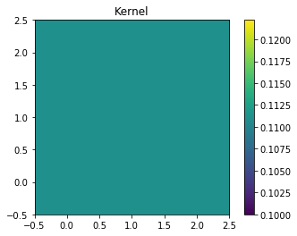

.. code:: ipython3

    fig, axes = plt.subplots(nrows=1, ncols=2)
    pmin,pmax = 10, 200
    a = axes[0].imshow(my_arr,interpolation='none', origin='lower',vmin=pmin, vmax=pmax)
    axes[0].set_title('Before Convolution')
    a = axes[1].imshow(result,interpolation='none', origin='lower',vmin=pmin, vmax=pmax)
    axes[1].set_title('After Convolution')
    
    fig.subplots_adjust(right = 0.8,left=0)
    cbar_ax = fig.add_axes([0.85, 0.15, 0.05, 0.7])
    fig.colorbar(a, cax=cbar_ax)
    fig.set_size_inches(10,5)
    plt.show()

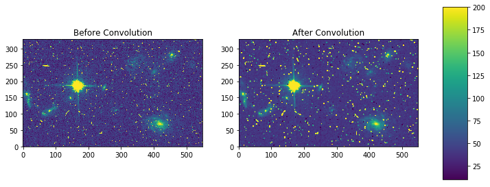

convolve
--------

**Please review the** `Notes <#notes>`__ **section above before running
any examples in this notebook**

The convolve task allows you to convolve your data array with a kernel
of your own creation. Here we show a simple example of a rectangular
kernel applied to a 10 by 10 array using the
``astropy.convolution.convolve`` function

.. code:: ipython3

    # Standard Imports
    import numpy as np
    
    # Astronomy Specific Imports
    from astropy.io import fits
    from astropy.convolution import convolve as ap_convolve
    
    # Plotting Imports/Setup
    import matplotlib.pyplot as plt
    %matplotlib inline

.. code:: ipython3

    # grab subsection of fits images
    test_data = '/eng/ssb/iraf_transition/test_data/jczgx1ppq_flc.fits'
    sci1 = fits.getdata(test_data,ext=1)
    my_arr = sci1[840:950,2350:2500]
    
    # add nan's to test array
    my_arr[40:50,60:70] = np.nan
    my_arr[70:73,110:113] = np.nan
    
    # setup our custom kernel
    my_kernel = [[0,1,0],[1,0,1],[0,1,0],[1,0,1],[0,1,0]]
    # perform convolution
    result = ap_convolve(my_arr, my_kernel, normalize_kernel=True, boundary='wrap')

.. code:: ipython3

    plt.imshow(my_kernel, interpolation='none', origin='lower')
    plt.title('Kernel')
    plt.colorbar()
    plt.show()

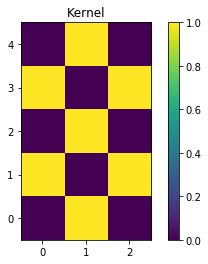

.. code:: ipython3

    fig, axes = plt.subplots(nrows=1, ncols=2)
    pmin,pmax = 10, 200
    a = axes[0].imshow(my_arr,interpolation='none', origin='lower',vmin=pmin, vmax=pmax)
    axes[0].set_title('Before Convolution')
    a = axes[1].imshow(result,interpolation='none', origin='lower',vmin=pmin, vmax=pmax)
    axes[1].set_title('After Convolution')
    
    fig.subplots_adjust(right = 0.8,left=0)
    cbar_ax = fig.add_axes([0.85, 0.15, 0.05, 0.7])
    fig.colorbar(a, cax=cbar_ax)
    fig.set_size_inches(10,5)
    plt.show()

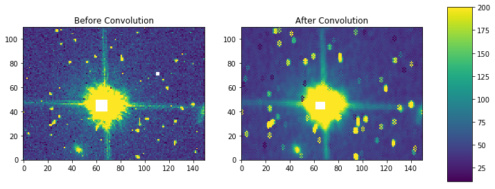

Here is an example using masking with ``scipy.convolve``

.. code:: ipython3

    # Standard Imports
    import numpy as np
    from scipy.ndimage import convolve as sp_convolve
    
    # Astronomy Specific Imports
    from astropy.io import fits
    
    # Plotting Imports/Setup
    import matplotlib.pyplot as plt
    %matplotlib inline

.. code:: ipython3

    # grab subsection of fits images
    test_data = '/eng/ssb/iraf_transition/test_data/jczgx1ppq_flc.fits'
    sci1 = fits.getdata(test_data,ext=1)
    my_arr = sci1[700:1030,2250:2800]
    
    # setup our custom kernel
    my_kernel = np.array([[0,1,0],[1,0,1],[0,1,0],[1,0,1],[0,1,0]]) * (1/7.0)
    # perform convolution
    result = sp_convolve(my_arr, my_kernel, mode='wrap')

.. code:: ipython3

    plt.imshow(my_kernel, interpolation='none', origin='lower')
    plt.title('Kernel')
    plt.colorbar()
    plt.show()

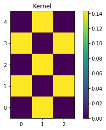

.. code:: ipython3

    fig, axes = plt.subplots(nrows=1, ncols=2)
    pmin,pmax = 10, 200
    a = axes[0].imshow(my_arr,interpolation='none', origin='lower',vmin=pmin, vmax=pmax)
    axes[0].set_title('Before Convolution')
    a = axes[1].imshow(result,interpolation='none', origin='lower',vmin=pmin, vmax=pmax)
    axes[1].set_title('After Convolution')
    
    fig.subplots_adjust(right = 0.8,left=0)
    cbar_ax = fig.add_axes([0.85, 0.15, 0.05, 0.7])
    fig.colorbar(a, cax=cbar_ax)
    fig.set_size_inches(10,5)
    plt.show()

gauss
-----

**Please review the** `Notes <#notes>`__ **section above before running
any examples in this notebook**

The gaussian kernel convolution applies a gaussian function convolution
to your data array. The
`Gaussian2DKernel <http://docs.astropy.org/en/stable/api/astropy.convolution.Gaussian2DKernel.html#astropy.convolution.Gaussian2DKernel>`__
size is defined slightly differently from the IRAF version.

.. code:: ipython3

    # Standard Imports
    import numpy as np
    
    # Astronomy Specific Imports
    from astropy.io import fits
    from astropy.convolution import convolve as ap_convolve
    from astropy.convolution import Gaussian2DKernel
    
    # Plotting Imports/Setup
    import matplotlib.pyplot as plt
    %matplotlib inline

.. code:: ipython3

    # grab subsection of fits images
    test_data = '/eng/ssb/iraf_transition/test_data/jczgx1ppq_flc.fits'
    sci1 = fits.getdata(test_data,ext=1)
    my_arr = sci1[700:1030,2250:2800]
    
    # setup our kernel, with 6 sigma and a 3 in x by 5 in y size
    gauss_kernel = Gaussian2DKernel(6, x_size=5, y_size=7)
    # perform convolution
    result = ap_convolve(my_arr, gauss_kernel, normalize_kernel=True)
    
    gauss_kernel

.. parsed-literal::

    <astropy.convolution.kernels.Gaussian2DKernel at 0x12875e048>

.. code:: ipython3

    plt.imshow(gauss_kernel, interpolation='none', origin='lower')
    plt.title('Kernel')
    plt.colorbar()
    plt.show()

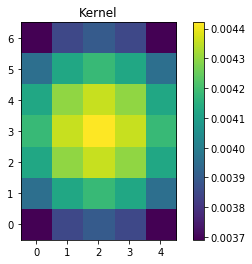

.. code:: ipython3

    fig, axes = plt.subplots(nrows=1, ncols=2)
    pmin,pmax = 10, 200
    a = axes[0].imshow(my_arr,interpolation='none', origin='lower',vmin=pmin, vmax=pmax)
    axes[0].set_title('Before Convolution')
    a = axes[1].imshow(result,interpolation='none', origin='lower',vmin=pmin, vmax=pmax)
    axes[1].set_title('After Convolution')
    
    fig.subplots_adjust(right = 0.8,left=0)
    cbar_ax = fig.add_axes([0.85, 0.15, 0.05, 0.7])
    fig.colorbar(a, cax=cbar_ax)
    fig.set_size_inches(10,5)
    plt.show()

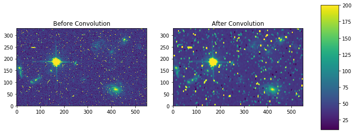

laplace
-------

**Please review the** `Notes <#notes>`__ **section above before running
any examples in this notebook**

The laplace task runs a image convolution using a laplacian filter with
a subset of footprints. For the ``scipy.ndimage.filter.laplace``
function we will be using, you can feed any footprint in as an array to
create your kernel.

.. code:: ipython3

    # Standard Imports
    import numpy as np
    from scipy.ndimage import convolve as sp_convolve
    from scipy.ndimage import laplace
    
    # Astronomy Specific Imports
    from astropy.io import fits
    
    # Plotting Imports/Setup
    import matplotlib.pyplot as plt
    %matplotlib inline

.. code:: ipython3

    # grab subsection of fits images
    test_data = '/eng/ssb/iraf_transition/test_data/jczgx1ppq_flc.fits'
    sci1 = fits.getdata(test_data,ext=1)
    my_arr = sci1[700:1030,2250:2800]
    
    # setup our laplace kernel with a target footprint (diagonals in IRAF)
    footprint = np.array([[0, 1, 0], [1, 1, 1], [0, 1, 0]])
    laplace_kernel = laplace(footprint)
    # perform scipy convolution
    result = sp_convolve(my_arr, laplace_kernel)

.. code:: ipython3

    plt.imshow(laplace_kernel, interpolation='none', origin='lower')
    plt.title('Kernel')
    plt.colorbar()
    plt.show()

.. image:: images.imfilter_files/images.imfilter_37_0.png

.. code:: ipython3

    fig, axes = plt.subplots(nrows=1, ncols=2)
    a = axes[0].imshow(my_arr,interpolation='none', origin='lower',vmin=0, vmax=70)
    axes[0].set_title('Before Convolution')
    a = axes[1].imshow(result,interpolation='none', origin='lower',vmin=0, vmax=70)
    axes[1].set_title('After Convolution')
    
    fig.subplots_adjust(right = 0.8,left=0)
    cbar_ax = fig.add_axes([0.85, 0.15, 0.05, 0.7])
    fig.colorbar(a, cax=cbar_ax)
    fig.set_size_inches(10,5)
    plt.show()

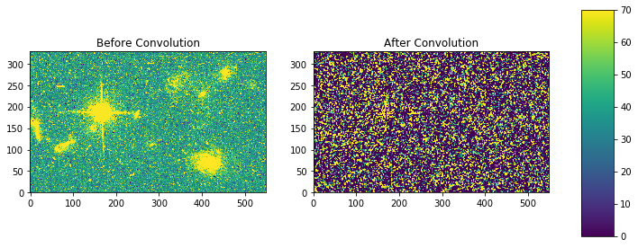

median-rmedian
--------------

**Please review the** `Notes <#notes>`__ **section above before running
any examples in this notebook**

Apply a median filter to your data array, and save the smoothed image
back out to a FITS file. We will use the
``scipy.ndimage.filters.median_filter`` function.

.. code:: ipython3

    # Standard Imports
    import numpy as np
    from scipy.ndimage.filters import median_filter
    
    # Astronomy Specific Imports
    from astropy.io import fits
    
    # Plotting Imports/Setup
    import matplotlib.pyplot as plt
    %matplotlib inline

.. code:: ipython3

    # create test array
    test_data = '/eng/ssb/iraf_transition/test_data/jczgx1ppq_flc.fits'
    out_file = 'median_out.fits'
    sci1 = fits.getdata(test_data,ext=1)
    my_arr = sci1[700:1030,2250:2800]
    
    # apply median filter
    filtered = median_filter(my_arr,size=(3,4))

.. code:: ipython3

    # save smoothed image to a new FITS file
    hdu = fits.PrimaryHDU(filtered)
    hdu.writeto(out_file, overwrite=True)

.. code:: ipython3

    fig, axes = plt.subplots(nrows=1, ncols=2)
    pmin,pmax = 10, 200
    a = axes[0].imshow(my_arr,interpolation='none', origin='lower',vmin=pmin, vmax=pmax)
    axes[0].set_title('Before Filter')
    a = axes[1].imshow(filtered,interpolation='none', origin='lower',vmin=pmin, vmax=pmax)
    axes[1].set_title('After Filter')
    
    fig.subplots_adjust(right = 0.8,left=0)
    cbar_ax = fig.add_axes([0.85, 0.15, 0.05, 0.7])
    fig.colorbar(a, cax=cbar_ax)
    fig.set_size_inches(10,5)
    plt.show()

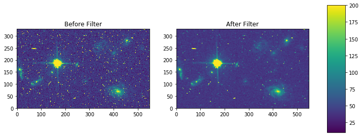

For a ring median filter we can supply a more specific footprint to the
``median_filter`` function. You can easily generate this footprint using
the ``astroimtools`` library

.. code:: ipython3

    # Standard Imports
    import numpy as np
    from scipy.ndimage.filters import median_filter
    
    # Astronomy Specific Imports
    from astropy.io import fits
    from astroimtools import circular_annulus_footprint
    
    # Plotting Imports/Setup
    import matplotlib.pyplot as plt
    %matplotlib inline
    
    #depreciation warning, is fixed already in the dev version, not sure when this is getting pushed

.. code:: ipython3

    # create test array
    test_data = '/eng/ssb/iraf_transition/test_data/jczgx1ppq_flc.fits'
    sci1 = fits.getdata(test_data,ext=1)
    my_arr = sci1[700:1030,2250:2800]
    
    # create annulus filter
    fp = circular_annulus_footprint(10, 12)
    # apply median filter
    filtered = median_filter(my_arr, footprint=fp)

.. code:: ipython3

    plt.imshow(fp, interpolation='none', origin='lower')
    plt.title('Annulus Footprint')
    plt.colorbar()
    plt.show()

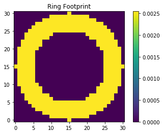

.. code:: ipython3

    fig, axes = plt.subplots(nrows=1, ncols=2)
    pmin,pmax = 10, 200
    a = axes[0].imshow(my_arr,interpolation='none', origin='lower',vmin=pmin, vmax=pmax)
    axes[0].set_title('Before Filter')
    a = axes[1].imshow(filtered,interpolation='none', origin='lower',vmin=pmin, vmax=pmax)
    axes[1].set_title('After Filter')
    
    fig.subplots_adjust(right = 0.8,left=0)
    cbar_ax = fig.add_axes([0.85, 0.15, 0.05, 0.7])
    fig.colorbar(a, cax=cbar_ax)
    fig.set_size_inches(10,5)
    plt.show()

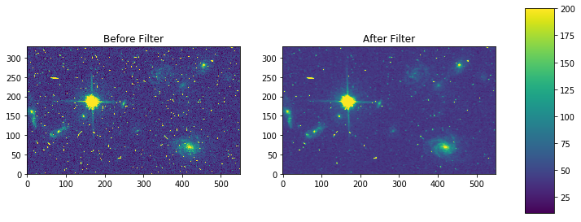

mode-rmode
----------

**Please review the** `Notes <#notes>`__ **section above before running
any examples in this notebook**

The mode calculation equation used in the mode and rmode IRAF tasks
(3.0\*median - 2.0\*mean) can be recreated using the
``scipy.ndimage.generic_filter`` function. The equation was used as an
approximation for a mode calculation.

.. code:: ipython3

    # Standard Imports
    import numpy as np
    from scipy.ndimage import generic_filter
    
    # Astronomy Specific Imports
    from astropy.io import fits
    
    # Plotting Imports/Setup
    import matplotlib.pyplot as plt
    %matplotlib inline

.. code:: ipython3

    def mode_func(in_arr):
        f = 3.0*np.median(in_arr) - 2.0*np.mean(in_arr)
        return f

For a box footprint:

.. code:: ipython3

    # create test array
    test_data = '/eng/ssb/iraf_transition/test_data/jczgx1ppq_flc.fits'
    sci1 = fits.getdata(test_data,ext=1)
    my_arr = sci1[700:1030,2250:2800]
    
    # apply mode filter
    filtered = generic_filter(my_arr,mode_func,size=5)

.. code:: ipython3

    fig, axes = plt.subplots(nrows=1, ncols=2)
    pmin,pmax = 10, 200
    a = axes[0].imshow(my_arr,interpolation='none', origin='lower',vmin=pmin, vmax=pmax)
    axes[0].set_title('Before Filter')
    a = axes[1].imshow(filtered,interpolation='none', origin='lower',vmin=pmin, vmax=pmax)
    axes[1].set_title('After Filter')
    
    fig.subplots_adjust(right = 0.8,left=0)
    cbar_ax = fig.add_axes([0.85, 0.15, 0.05, 0.7])
    fig.colorbar(a, cax=cbar_ax)
    fig.set_size_inches(10,5)
    plt.show()

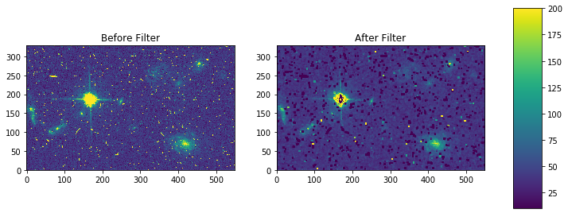

For a ring footprint:

.. code:: ipython3

    # Standard Imports
    import numpy as np
    from scipy.ndimage import generic_filter
    
    # Astronomy Specific Imports
    from astropy.io import fits
    from astroimtools import circular_annulus_footprint
    
    # Plotting Imports/Setup
    import matplotlib.pyplot as plt
    %matplotlib inline

.. code:: ipython3

    # create test array
    test_data = '/eng/ssb/iraf_transition/test_data/jczgx1ppq_flc.fits'
    sci1 = fits.getdata(test_data,ext=1)
    my_arr = sci1[700:1030,2250:2800]
    
    # create annulus filter
    fp = circular_annulus_footprint(5, 9)
    # apply mode filter
    filtered = generic_filter(my_arr,mode_func,footprint=fp)

.. code:: ipython3

    plt.imshow(fp, interpolation='none', origin='lower')
    plt.title('Annulus Footprint')
    plt.colorbar()
    plt.show()

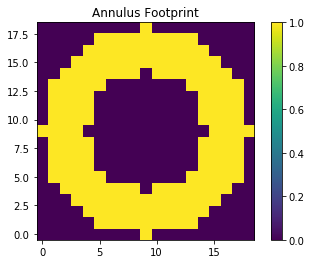

.. code:: ipython3

    fig, axes = plt.subplots(nrows=1, ncols=2)
    pmin,pmax = 10, 200
    a = axes[0].imshow(my_arr,interpolation='none', origin='lower',vmin=pmin, vmax=pmax)
    axes[0].set_title('Before Filter')
    a = axes[1].imshow(filtered,interpolation='none', origin='lower',vmin=pmin, vmax=pmax)
    axes[1].set_title('After Filter')
    
    fig.subplots_adjust(right = 0.8,left=0)
    cbar_ax = fig.add_axes([0.85, 0.15, 0.05, 0.7])
    fig.colorbar(a, cax=cbar_ax)
    fig.set_size_inches(10,5)
    plt.show()

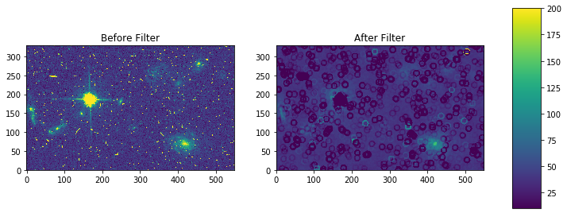

Not Replacing
-------------

-  runmed - see **images.imutil.imsum**
-  fmode - see `images.imfilter.mode <#mode-rmode>`__
-  fmedian - see `images.imfilter.median <#median-rmedian>`__
-  gradient - **may** replace in future
