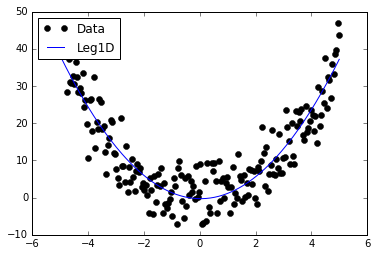
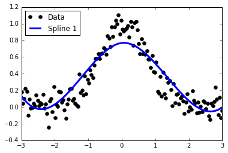
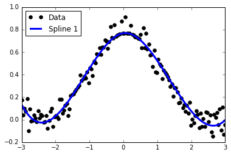
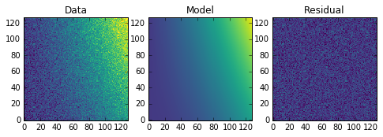

:orphan:

images.imfit
============

images.imfit contains three functions for fitting and value replacement.

Notes
-----

**For questions or comments please see** `our github
page <https://github.com/spacetelescope/stak>`__. **We encourage and
appreciate user feedback.**

The fitting and replacement functionality of images.imfit can be
replaced using tools avialable in
`Astropy <http://docs.astropy.org/en/stable/modeling/>`__, and
`Scipy <https://docs.scipy.org/doc/scipy/reference/interpolate.html>`__.
Please see the linked doc pages for more details. These fitting
functions have a lot more options and function types then what was
available in IRAF.

All tasks in the images.imfit package provide the same function type
options. Here is a conversion for these functions in Python:

-  leg - astropy.modeling.polynomial.Legendre1D (or 2D)
-  cheb - astropy.modeling.polynomial.Chebyshev1D (or 2D)
-  spline1 - scipy.interpolate.UnivariantSpline
-  spline3 - scipy.interpolate.CubicSpline

For ngrow the option (not covered here) see ``disk`` and ``dilation``
from
`skimage.morphology <http://scikit-image.org/docs/0.13.x/api/skimage.morphology.html?highlight=morphology#module-skimage.morphology>`__

Contents:

-  `fit1d-lineclean <#fit1d-lineclean>`__
-  `imsurfit <#imsurfit>`__

.. code:: ipython2

    # Temporarily change default colormap to viridis
    import matplotlib.pyplot as plt
    plt.rcParams['image.cmap'] = 'viridis'

fit1d-lineclean
---------------

**Please review the** `Notes <#notes>`__ **section above before running
any examples in this notebook**

The fit1d task will fit a function to a 1d data array. The lineclean
task will take this same fitting tasks, and return your data array with
values outside a certain sigma limit replaced with the fitted values. We
can preform both these tasks with ``astropy`` and ``scipy`` functions.
You'll find many more models defined in the ``astropy.models`` library
`here <http://docs.astropy.org/en/stable/modeling/#module-astropy.modeling>`__

Below we show one example using a Legendre 1D fit, and another example
using a linar spine. For the linear spline example we will go over an
implementation of lineclean.

.. code:: ipython2

    # Standard Imports
    import numpy as np
    from scipy.interpolate import UnivariateSpline
    
    # Astronomy Specific Imports
    from astropy.modeling import models, fitting, polynomial
    
    # Plotting Imports/Setup
    import matplotlib.pyplot as plt
    %matplotlib inline

.. code:: ipython2

    # Fitting - Legendre1D
    # This example is taken in part from examples on the Astropy Modeling documentation
    
    # Generate fake data
    np.random.seed(0)
    x = np.linspace(-5., 5., 200)
    y = 0.5 * (3*x**2-1)
    y += np.random.normal(0., 5, x.shape)
    
    # Fit the data using the Legendre1D fitter
    leg_init = polynomial.Legendre1D(2)
    fit_leg = fitting.LevMarLSQFitter()
    leg = fit_leg(leg_init, x, y)
    
    # Plot solution
    plt.plot(x, y, 'ko', label='Data')
    plt.plot(x, leg(x), label='Leg1D')
    plt.legend(loc=2)

.. parsed-literal::

    <matplotlib.legend.Legend at 0x116319110>

.. code:: ipython2

    # Fitting - Spline1
    # This example is taken in part from examples on the Astropy Modeling documentation
    
    # Generate fake data
    np.random.seed(0)
    x = np.linspace(-3., 3., 150)
    y = np.exp(-x**2) + 0.1 * np.random.randn(150)
    
    # Fit the data using the Spline 1 fitter
    spl1 = UnivariateSpline(x, y)
    spl1.set_smoothing_factor(3)
    
    # Plot solution
    plt.plot(x, y, 'ko', label='Data')
    plt.plot(x, spl1(x),lw=3,label='Spline 1')
    plt.legend(loc=2)

.. parsed-literal::

    <matplotlib.legend.Legend at 0x11d96c110>

.. code:: ipython2

    # Value Replacement - Spline 1
    
    # Fit array
    fit_data = spl1(x)
    residuals = fit_data-y
    sigma = np.std(residuals)
    
    # Let's reject everything outside of 1-sigma of the fit residuals
    boolean_array = [np.absolute(residuals) > sigma]
    y[boolean_array] = fit_data[boolean_array]

.. code:: ipython2

    # Plot solution
    plt.plot(x, y, 'ko', label='Data')
    plt.plot(x, spl1(x),lw=3,label='Spline 1')
    plt.legend(loc=2)

.. parsed-literal::

    <matplotlib.legend.Legend at 0x11dc43a10>

imsurfit
--------

**Please review the** `Notes <#notes>`__ **section above before running
any examples in this notebook**

Imsurfit has similiar functionality to the above tasks, but in 2
dimensions. Below we show a brief example, which can be extended as
shown above in the `lineclean <#fit1d>`__ example. We use the
``Polynomial2D`` ``astropy.modeling`` example here to showcase the usage
of models not found in this IRAF library.

.. code:: ipython2

    # Standard Imports
    import numpy as np
    
    # Astronomy Specific Imports
    from astropy.modeling import models, fitting
    
    # Plotting Imports/Setup
    import matplotlib.pyplot as plt
    %matplotlib inline

.. code:: ipython2

    # Fitting - Polynomial2D
    # This example is taken from the Astropy Modeling documentation
    
    # Generate fake data
    np.random.seed(0)
    y, x = np.mgrid[:128, :128]
    z = 2. * x ** 2 - 0.5 * x ** 2 + 1.5 * x * y - 1.
    z += np.random.normal(0., 0.1, z.shape) * 50000.
    
    # Fit the data using astropy.modeling
    p_init = models.Polynomial2D(degree=2)
    fit_p = fitting.LevMarLSQFitter()
    p = fit_p(p_init, x, y, z)
    
    # Plot the data with the best-fit model
    plt.figure(figsize=(8, 2.5))
    plt.subplot(1, 3, 1)
    plt.imshow(z, origin='lower', interpolation='nearest', vmin=-1e4, vmax=5e4)
    plt.title("Data")
    plt.subplot(1, 3, 2)
    plt.imshow(p(x, y), origin='lower', interpolation='nearest', vmin=-1e4,
               vmax=5e4)
    plt.title("Model")
    plt.subplot(1, 3, 3)
    plt.imshow(z - p(x, y), origin='lower', interpolation='nearest', vmin=-1e4,
               vmax=5e4)
    plt.title("Residual")

.. parsed-literal::

    <matplotlib.text.Text at 0x101ef5a50>

