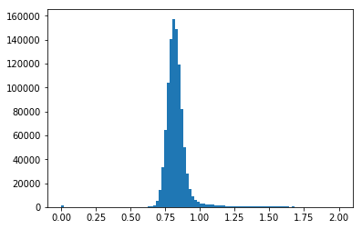

:orphan:

images.imutil
=============

The images.imutil package provides general FITS image tools such as
header editing and image arithmetic.

Notes
-----

**For questions or comments please see** `our github
page <https://github.com/spacetelescope/stak>`__. **We encourage and
appreciate user feedback.**

**Most of these notebooks rely on basic knowledge of the Astropy FITS
I/O module. If you are unfamiliar with this module please see the**
`Astropy FITS I/O user
documentation <http://docs.astropy.org/en/stable/io/fits/>`__ **before
using this documentation**.

Contents:

-  `chpixtype <#chpixtype>`__
-  `hedit <#hedit>`__
-  `hselect <#hselect>`__
-  `imarith-imdivide <#imarith-imdivide>`__
-  `imcopy <#imcopy>`__
-  `imfunction-imexpr <#imfunction-imexpr>`__
-  `imheader <#imheader>`__
-  `imhistogram <#imhistogram>`__
-  `imreplace <#imreplace>`__
-  `imstack-imslice <#imslice>`__
-  `imstatistics <#imstatistics>`__
-  `imsum <#imsum>`__
-  `listpixels <#listpixels>`__

chpixtype
---------

**Please review the** `Notes <#notes>`__ **section above before running
any examples in this notebook**

Chpixtype is a task that allows you to change the pixel type of a FITS
image. There is built in functionality in ``astropy.io.fits`` to preform
this task with the ``scale`` method. Below you will find a table that
translates the chpixtype newpixtype options into their equivalent
`numpy/astropy
type <http://docs.scipy.org/doc/numpy/user/basics.types.html>`__.

**Type Conversions**

+--------------+----------------------+
| Chpixtype    | Numpy/Astropy Type   |
+==============+======================+
| ``ushort``   | ``uint16``           |
+--------------+----------------------+
| ``short``    | ``int16``            |
+--------------+----------------------+
| ``int``      | ``int32``            |
+--------------+----------------------+
| ``long``     | ``int64``            |
+--------------+----------------------+
| ``real``     | ``float32``          |
+--------------+----------------------+
| ``double``   | ``float64``          |
+--------------+----------------------+

.. code:: ipython3

    # Standard Imports
    import numpy as np
    
    # Astronomy Specific Imports
    from astropy.io import fits
    from astroquery.mast import Observations

.. code:: ipython3

    # Download test file using astroquery, this only needs to be run once
    # and can be skipped if using your own data.
    # Astroquery will only download file if not already present.
    obsid = '2004615006'
    Observations.download_products(obsid,productFilename="iczgs3ygq_flt.fits")

.. parsed-literal::

    Downloading URL https://mast.stsci.edu/api/v0/download/file?uri=mast:HST/product/iczgs3ygq/iczgs3ygq_flt.fits to ./mastDownload/HST/ICZGS3YGQ/iczgs3ygq_flt.fits ... [Done]

.. raw:: html

    <i>Table length=1</i>
    <table id="table90597018144" class="table-striped table-bordered table-condensed">
    <thead><tr><th>Local Path</th><th>Status</th><th>Message</th><th>URL</th></tr></thead>
    <thead><tr><th>str47</th><th>str5</th><th>str87</th><th>str93</th></tr></thead>
    <tr><td>./mastDownload/HST/ICZGS3YGQ/iczgs3ygq_flt.fits</td><td>ERROR</td><td>Downloaded filesize is 16531200,but should be 16534080, file may be partial or corrupt.</td><td>https://mast.stsci.edu/api/v0/download/file?uri=mast:HST/product/iczgs3ygq/iczgs3ygq_flt.fits</td></tr>
    </table>

.. code:: ipython3

    # Change this value to your desired data file, here were creating a filename
    # for our new changed data
    orig_data = './mastDownload/HST/ICZGS3YGQ/iczgs3ygq_flt.fits'
    new_data = 'iczgs3ygq_newdtype_flt.fits'
    
    # Read in your FITS file
    hdu = fits.open(orig_data)
    
    # Print info about FITS file
    hdu.info()
    
    # Edit the datatype for the first sci extension
    hdu[1].scale(type='int32')
    
    # Save changed hdu object to new file
    # The overwrite argument tells the writeto method to overwrite if file already exists
    hdu.writeto(new_data, overwrite=True)
    hdu.close()

.. parsed-literal::

    Filename: ./mastDownload/HST/ICZGS3YGQ/iczgs3ygq_flt.fits
    No.    Name      Ver    Type      Cards   Dimensions   Format
      0  PRIMARY       1 PrimaryHDU     265   ()      
      1  SCI           1 ImageHDU       140   (1014, 1014)   float32   
      2  ERR           1 ImageHDU        51   (1014, 1014)   float32   
      3  DQ            1 ImageHDU        43   (1014, 1014)   int16   
      4  SAMP          1 ImageHDU        37   (1014, 1014)   int16   
      5  TIME          1 ImageHDU        37   (1014, 1014)   float32   
      6  WCSCORR       1 BinTableHDU     59   7R x 24C   [40A, I, A, 24A, 24A, 24A, 24A, D, D, D, D, D, D, D, D, 24A, 24A, D, D, D, D, J, 40A, 128A]   

hedit
-----

**Please review the** `Notes <#notes>`__ **section above before running
any examples in this notebook**

The hedit task allows users to edit an image header. This functioanlity
is covered in ``astropy.io.fits``. Take note that to make changes to a
FITS file, you must use the ``mode='update'`` keyword in the
``fits.open`` call. The default mode for ``fits.open`` is ``readonly``.
Below you'll find examples of editing a keyword if it does/doesn't
exist, and how to delete keywords from the header. Also provided is an
example of updating multiple files at once using the `convience function
setval <http://docs.astropy.org/en/stable/io/fits/api/files.html#setval>`__.

For examples on printing/viewing header keywords please see
`hselect <#hselect>`__

.. code:: ipython3

    # Standard Imports
    from glob import glob
    
    # Astronomy Specific Imports
    from astropy.io import fits
    from astroquery.mast import Observations

.. code:: ipython3

    # Download test file using astroquery, this only needs to be run once
    # and can be skipped if using your own data.
    # Astroquery will only download file if not already present.
    obsid = '2004615006'
    Observations.download_products(obsid,productFilename="iczgs3ygq_flt.fits")

.. parsed-literal::

    INFO: Found cached file ./mastDownload/HST/ICZGS3YGQ/iczgs3ygq_flt.fits with expected size 16534080. [astroquery.query]

.. raw:: html

    <i>Table length=1</i>
    <table id="table90597339880" class="table-striped table-bordered table-condensed">
    <thead><tr><th>Local Path</th><th>Status</th><th>Message</th><th>URL</th></tr></thead>
    <thead><tr><th>str47</th><th>str5</th><th>str87</th><th>str93</th></tr></thead>
    <tr><td>./mastDownload/HST/ICZGS3YGQ/iczgs3ygq_flt.fits</td><td>ERROR</td><td>Downloaded filesize is 16531200,but should be 16534080, file may be partial or corrupt.</td><td>https://mast.stsci.edu/api/v0/download/file?uri=mast:HST/product/iczgs3ygq/iczgs3ygq_flt.fits</td></tr>
    </table>

.. code:: ipython3

    # Change this value to your desired data file
    test_data = './mastDownload/HST/ICZGS3YGQ/iczgs3ygq_flt.fits'
    
    # Open FITS file, include the mode='update' keyword
    hdu = fits.open(test_data, mode='update')
    
    # Simple header change, will add keyword if it doesn't exist
    hdu[0].header['MYKEY1'] = 'Editing this keyword'
    
    # Only add keyword if it does not already exist:
    if 'MYKEY2' not in hdu[0].header:
        hdu[0].header['MYKEY2'] = 'Also editing this'
    
    # To delete keywords, first check if they exist:
    if 'MYKEY2' in hdu[0].header:
        del hdu[0].header['MYKEY2']
        
    # Close FITS file, this will save your changes
    hdu.close()

Below we will show an example of how to update a keyword in multiple
FITS files using the Astropy convenience function
`astropy.io.fits.setval <http://docs.astropy.org/en/stable/io/fits/api/files.html#setval>`__
and the `glob <https://docs.python.org/3/library/glob.html>`__ function.
``Astropy.io.fits.setval`` will add the keyword if it does not already
exist.

.. code:: ipython3

    # Change this value to your desired search
    data_list = glob('./mastDownload/HST/ICZGS3YGQ/*.fits')
    
    # Now we loop over the list of file and use the setval function to update keywords
    # Here we update the keyword MYKEY1 value to the integer 5.
    for filename in data_list:
        fits.setval(filename, 'MYKEY1', value=5)

hselect
-------

**Please review the** `Notes <#notes>`__ **section above before running
any examples in this notebook**

The hselect task allows users to search for keyword values in the FITS
headers. This functionality has been replaced by the `CCDProc
ImageFileCollection
class <http://ccdproc.readthedocs.io/en/stable/api/ccdproc.ImageFileCollection.html>`__.
This class stores the header keyword values in an `Astropy Table
object <http://docs.astropy.org/en/stable/table/index.html#module-astropy.table>`__.
There is also an executable script provided by Astropy called
`fitsheader <http://docs.astropy.org/en/stable/io/fits/usage/scripts.html#module-astropy.io.fits.scripts.fitsheader>`__.
You'll find examples of both below.

If you wish to save your output to a text file, please see the `Astropy
Table Documentation <http://docs.astropy.org/en/stable/table/io.html>`__
and the `Astropy Unified I/O
page <http://docs.astropy.org/en/stable/io/unified.html>`__.

.. code:: ipython3

    # Astronomy Specific Imports
    from ccdproc import ImageFileCollection
    from astroquery.mast import Observations

.. code:: ipython3

    # Download test file using astroquery, this only needs to be run once
    # and can be skipped if using your own data.
    # Astroquery will only download file if not already present.
    obsid = '2004663553'
    Observations.download_products(obsid, productFilename="jczgx1ppq_flc.fits")
    obsid = '2004663554'
    Observations.download_products(obsid, productFilename="jczgx1ptq_flc.fits")
    obsid = '2004663556'
    Observations.download_products(obsid, productFilename="jczgx1q1q_flc.fits")
    
    import shutil
    shutil.move('./mastDownload/HST/JCZGX1PPQ/jczgx1ppq_flc.fits','../data/')
    shutil.move('./mastDownload/HST/JCZGX1PTQ/jczgx1ptq_flc.fits','../data/')
    shutil.move('./mastDownload/HST/JCZGX1Q1Q/jczgx1q1q_flc.fits','../data/')

.. parsed-literal::

    INFO:astropy:Found cached file ./mastDownload/HST/JCZGX1PPQ/jczgx1ppq_flc.fits with expected size 167964480.

.. parsed-literal::

    INFO: Found cached file ./mastDownload/HST/JCZGX1PPQ/jczgx1ppq_flc.fits with expected size 167964480. [astroquery.query]

.. parsed-literal::

    INFO:astropy:Found cached file ./mastDownload/HST/JCZGX1PTQ/jczgx1ptq_flc.fits with expected size 167964480.

.. parsed-literal::

    INFO: Found cached file ./mastDownload/HST/JCZGX1PTQ/jczgx1ptq_flc.fits with expected size 167964480. [astroquery.query]

.. parsed-literal::

    INFO:astropy:Found cached file ./mastDownload/HST/JCZGX1Q1Q/jczgx1q1q_flc.fits with expected size 167964480.

.. parsed-literal::

    INFO: Found cached file ./mastDownload/HST/JCZGX1Q1Q/jczgx1q1q_flc.fits with expected size 167964480. [astroquery.query]

.. parsed-literal::

    '../data/jczgx1q1q_flc.fits'

.. code:: ipython3

    # first we make the ImageFileCollection object
    collec = ImageFileCollection('../data/', 
                                 keywords=["filetype","date","exptime","filter2"],
                                 glob_include="jcz*.fits", ext=0)
    
    # header keywords values are stored in an Astropy Table in the summary attribute 
    out_table = collec.summary
    out_table

.. raw:: html

    <i>Table masked=True length=3</i>
    <table id="table103576438656" class="table-striped table-bordered table-condensed">
    <thead><tr><th>file</th><th>filetype</th><th>date</th><th>exptime</th><th>filter2</th></tr></thead>
    <thead><tr><th>str18</th><th>str3</th><th>str10</th><th>float64</th><th>str5</th></tr></thead>
    <tr><td>jczgx1ppq_flc.fits</td><td>SCI</td><td>2017-12-03</td><td>578.0</td><td>F814W</td></tr>
    <tr><td>jczgx1ptq_flc.fits</td><td>SCI</td><td>2017-12-03</td><td>607.0</td><td>F814W</td></tr>
    <tr><td>jczgx1q1q_flc.fits</td><td>SCI</td><td>2017-12-03</td><td>578.0</td><td>F814W</td></tr>
    </table>

.. code:: ipython3

    # Now we can filter our table based on keyword values using Python bitwise operators
    filtered_table = out_table[(out_table['exptime'] < 600) & (out_table['filter2'] == 'F814W')]
    filtered_table

.. raw:: html

    <i>Table masked=True length=2</i>
    <table id="table103577396000" class="table-striped table-bordered table-condensed">
    <thead><tr><th>file</th><th>filetype</th><th>date</th><th>exptime</th><th>filter2</th></tr></thead>
    <thead><tr><th>str18</th><th>str3</th><th>str10</th><th>float64</th><th>str5</th></tr></thead>
    <tr><td>jczgx1ppq_flc.fits</td><td>SCI</td><td>2017-12-03</td><td>578.0</td><td>F814W</td></tr>
    <tr><td>jczgx1q1q_flc.fits</td><td>SCI</td><td>2017-12-03</td><td>578.0</td><td>F814W</td></tr>
    </table>

.. code:: ipython3

    # Now let's extract the filename list from our filtered table into a python List object
    filelist = filtered_table['file'].data
    print(filelist)
    
    for filename in filelist:
        print(filename)
        # Do your analysis here

.. parsed-literal::

    ['jczgx1ppq_flc.fits' 'jczgx1q1q_flc.fits']
    jczgx1ppq_flc.fits
    jczgx1q1q_flc.fits

Also available is the Astropy executable script fitsheader. Fitsheader
can be run from the command line.

.. code:: ipython3

    # the "!" character tells the notebook to run this command as if it were in a terminal window
    !fitsheader --help

.. parsed-literal::

    usage: fitsheader [-h] [-e HDU] [-k KEYWORD] [-t [FORMAT]] [-c]
                      filename [filename ...]
    
    Print the header(s) of a FITS file. Optional arguments allow the desired
    extension(s), keyword(s), and output format to be specified. Note that in the
    case of a compressed image, the decompressed header is shown by default.
    
    positional arguments:
      filename              path to one or more files; wildcards are supported
    
    optional arguments:
      -h, --help            show this help message and exit
      -e HDU, --extension HDU
                            specify the extension by name or number; this argument
                            can be repeated to select multiple extensions
      -k KEYWORD, --keyword KEYWORD
                            specify a keyword; this argument can be repeated to
                            select multiple keywords; also supports wildcards
      -t [FORMAT], --table [FORMAT]
                            print the header(s) in machine-readable table format;
                            the default format is "ascii.fixed_width" (can be
                            "ascii.csv", "ascii.html", "ascii.latex", "fits", etc)
      -c, --compressed      for compressed image data, show the true header which
                            describes the compression rather than the data

.. code:: ipython3

    # print out only the keyword names that match FILE* or NAXIS*
    !fitsheader --keyword FILE* --keyword NAXIS* ../data/*.fits

.. parsed-literal::

    # HDU 0 in ../data/imstack_out.fits:
    NAXIS   =                    3 / number of array dimensions                     
    NAXIS1  =                 4096                                                  
    NAXIS2  =                 2048                                                  
    NAXIS3  =                    2                                                  
    # HDU 0 in ../data/jczgx1ppq_flc.fits:
    FILENAME= 'jczgx1ppq_flc.fits' / name of file                                   
    FILETYPE= 'SCI      '          / type of data found in data file                
    NAXIS   =                    0 / number of data axes                            
    
    # HDU 1 in ../data/jczgx1ppq_flc.fits:
    NAXIS   =                    2 / number of data axes                            
    NAXIS1  =                 4096 / length of data axis 1                          
    NAXIS2  =                 2048 / length of data axis 2                          
    
    # HDU 2 in ../data/jczgx1ppq_flc.fits:
    NAXIS   =                    2 / number of data axes                            
    NAXIS1  =                 4096 / length of data axis 1                          
    NAXIS2  =                 2048 / length of data axis 2                          
    
    # HDU 3 in ../data/jczgx1ppq_flc.fits:
    NAXIS   =                    2 / number of data axes                            
    NAXIS1  =                 4096 / length of data axis 1                          
    NAXIS2  =                 2048 / length of data axis 2                          
    
    # HDU 4 in ../data/jczgx1ppq_flc.fits:
    NAXIS   =                    2 / number of data axes                            
    NAXIS1  =                 4096 / length of data axis 1                          
    NAXIS2  =                 2048 / length of data axis 2                          
    
    # HDU 5 in ../data/jczgx1ppq_flc.fits:
    NAXIS   =                    2 / number of data axes                            
    NAXIS1  =                 4096 / length of data axis 1                          
    NAXIS2  =                 2048 / length of data axis 2                          
    
    # HDU 6 in ../data/jczgx1ppq_flc.fits:
    NAXIS   =                    2 / number of data axes                            
    NAXIS1  =                 4096 / length of data axis 1                          
    NAXIS2  =                 2048 / length of data axis 2                          
    
    # HDU 7 in ../data/jczgx1ppq_flc.fits:
    NAXIS   =                    2 / number of array dimensions                     
    NAXIS1  =                   64                                                  
    NAXIS2  =                   32                                                  
    
    # HDU 8 in ../data/jczgx1ppq_flc.fits:
    NAXIS   =                    2 / number of array dimensions                     
    NAXIS1  =                   64                                                  
    NAXIS2  =                   32                                                  
    
    # HDU 9 in ../data/jczgx1ppq_flc.fits:
    NAXIS   =                    2 / number of array dimensions                     
    NAXIS1  =                   64                                                  
    NAXIS2  =                   32                                                  
    
    # HDU 10 in ../data/jczgx1ppq_flc.fits:
    NAXIS   =                    2 / number of array dimensions                     
    NAXIS1  =                   64                                                  
    NAXIS2  =                   32                                                  
    
    # HDU 11 in ../data/jczgx1ppq_flc.fits:
    NAXIS   =                    2 / number of array dimensions                     
    NAXIS1  =                   64                                                  
    NAXIS2  =                   32                                                  
    
    # HDU 12 in ../data/jczgx1ppq_flc.fits:
    NAXIS   =                    2 / number of array dimensions                     
    NAXIS1  =                   64                                                  
    NAXIS2  =                   32                                                  
    
    # HDU 13 in ../data/jczgx1ppq_flc.fits:
    NAXIS   =                    2 / number of array dimensions                     
    NAXIS1  =                   64                                                  
    NAXIS2  =                   32                                                  
    
    # HDU 14 in ../data/jczgx1ppq_flc.fits:
    NAXIS   =                    2 / number of array dimensions                     
    NAXIS1  =                   64                                                  
    NAXIS2  =                   32                                                  
    
    # HDU 15 in ../data/jczgx1ppq_flc.fits:
    NAXIS   =                    2 / number of array dimensions                     
    NAXIS1  =                  455 / length of dimension 1                          
    NAXIS2  =                   14 / length of dimension 2                          
    # HDU 0 in ../data/jczgx1ptq_flc.fits:
    FILENAME= 'jczgx1ptq_flc.fits' / name of file                                   
    FILETYPE= 'SCI      '          / type of data found in data file                
    NAXIS   =                    0 / number of data axes                            
    
    # HDU 1 in ../data/jczgx1ptq_flc.fits:
    NAXIS   =                    2 / number of data axes                            
    NAXIS1  =                 4096 / length of data axis 1                          
    NAXIS2  =                 2048 / length of data axis 2                          
    
    # HDU 2 in ../data/jczgx1ptq_flc.fits:
    NAXIS   =                    2 / number of data axes                            
    NAXIS1  =                 4096 / length of data axis 1                          
    NAXIS2  =                 2048 / length of data axis 2                          
    
    # HDU 3 in ../data/jczgx1ptq_flc.fits:
    NAXIS   =                    2 / number of data axes                            
    NAXIS1  =                 4096 / length of data axis 1                          
    NAXIS2  =                 2048 / length of data axis 2                          
    
    # HDU 4 in ../data/jczgx1ptq_flc.fits:
    NAXIS   =                    2 / number of data axes                            
    NAXIS1  =                 4096 / length of data axis 1                          
    NAXIS2  =                 2048 / length of data axis 2                          
    
    # HDU 5 in ../data/jczgx1ptq_flc.fits:
    NAXIS   =                    2 / number of data axes                            
    NAXIS1  =                 4096 / length of data axis 1                          
    NAXIS2  =                 2048 / length of data axis 2                          
    
    # HDU 6 in ../data/jczgx1ptq_flc.fits:
    NAXIS   =                    2 / number of data axes                            
    NAXIS1  =                 4096 / length of data axis 1                          
    NAXIS2  =                 2048 / length of data axis 2                          
    
    # HDU 7 in ../data/jczgx1ptq_flc.fits:
    NAXIS   =                    2 / number of array dimensions                     
    NAXIS1  =                   64                                                  
    NAXIS2  =                   32                                                  
    
    # HDU 8 in ../data/jczgx1ptq_flc.fits:
    NAXIS   =                    2 / number of array dimensions                     
    NAXIS1  =                   64                                                  
    NAXIS2  =                   32                                                  
    
    # HDU 9 in ../data/jczgx1ptq_flc.fits:
    NAXIS   =                    2 / number of array dimensions                     
    NAXIS1  =                   64                                                  
    NAXIS2  =                   32                                                  
    
    # HDU 10 in ../data/jczgx1ptq_flc.fits:
    NAXIS   =                    2 / number of array dimensions                     
    NAXIS1  =                   64                                                  
    NAXIS2  =                   32                                                  
    
    # HDU 11 in ../data/jczgx1ptq_flc.fits:
    NAXIS   =                    2 / number of array dimensions                     
    NAXIS1  =                   64                                                  
    NAXIS2  =                   32                                                  
    
    # HDU 12 in ../data/jczgx1ptq_flc.fits:
    NAXIS   =                    2 / number of array dimensions                     
    NAXIS1  =                   64                                                  
    NAXIS2  =                   32                                                  
    
    # HDU 13 in ../data/jczgx1ptq_flc.fits:
    NAXIS   =                    2 / number of array dimensions                     
    NAXIS1  =                   64                                                  
    NAXIS2  =                   32                                                  
    
    # HDU 14 in ../data/jczgx1ptq_flc.fits:
    NAXIS   =                    2 / number of array dimensions                     
    NAXIS1  =                   64                                                  
    NAXIS2  =                   32                                                  
    
    # HDU 15 in ../data/jczgx1ptq_flc.fits:
    NAXIS   =                    2 / number of array dimensions                     
    NAXIS1  =                  455 / length of dimension 1                          
    NAXIS2  =                   14 / length of dimension 2                          
    # HDU 0 in ../data/jczgx1q1q_flc.fits:
    FILENAME= 'jczgx1q1q_flc.fits' / name of file                                   
    FILETYPE= 'SCI      '          / type of data found in data file                
    NAXIS   =                    0 / number of data axes                            
    
    # HDU 1 in ../data/jczgx1q1q_flc.fits:
    NAXIS   =                    2 / number of data axes                            
    NAXIS1  =                 4096 / length of data axis 1                          
    NAXIS2  =                 2048 / length of data axis 2                          
    
    # HDU 2 in ../data/jczgx1q1q_flc.fits:
    NAXIS   =                    2 / number of data axes                            
    NAXIS1  =                 4096 / length of data axis 1                          
    NAXIS2  =                 2048 / length of data axis 2                          
    
    # HDU 3 in ../data/jczgx1q1q_flc.fits:
    NAXIS   =                    2 / number of data axes                            
    NAXIS1  =                 4096 / length of data axis 1                          
    NAXIS2  =                 2048 / length of data axis 2                          
    
    # HDU 4 in ../data/jczgx1q1q_flc.fits:
    NAXIS   =                    2 / number of data axes                            
    NAXIS1  =                 4096 / length of data axis 1                          
    NAXIS2  =                 2048 / length of data axis 2                          
    
    # HDU 5 in ../data/jczgx1q1q_flc.fits:
    NAXIS   =                    2 / number of data axes                            
    NAXIS1  =                 4096 / length of data axis 1                          
    NAXIS2  =                 2048 / length of data axis 2                          
    
    # HDU 6 in ../data/jczgx1q1q_flc.fits:
    NAXIS   =                    2 / number of data axes                            
    NAXIS1  =                 4096 / length of data axis 1                          
    NAXIS2  =                 2048 / length of data axis 2                          
    
    # HDU 7 in ../data/jczgx1q1q_flc.fits:
    NAXIS   =                    2 / number of array dimensions                     
    NAXIS1  =                   64                                                  
    NAXIS2  =                   32                                                  
    
    # HDU 8 in ../data/jczgx1q1q_flc.fits:
    NAXIS   =                    2 / number of array dimensions                     
    NAXIS1  =                   64                                                  
    NAXIS2  =                   32                                                  
    
    # HDU 9 in ../data/jczgx1q1q_flc.fits:
    NAXIS   =                    2 / number of array dimensions                     
    NAXIS1  =                   64                                                  
    NAXIS2  =                   32                                                  
    
    # HDU 10 in ../data/jczgx1q1q_flc.fits:
    NAXIS   =                    2 / number of array dimensions                     
    NAXIS1  =                   64                                                  
    NAXIS2  =                   32                                                  
    
    # HDU 11 in ../data/jczgx1q1q_flc.fits:
    NAXIS   =                    2 / number of array dimensions                     
    NAXIS1  =                   64                                                  
    NAXIS2  =                   32                                                  
    
    # HDU 12 in ../data/jczgx1q1q_flc.fits:
    NAXIS   =                    2 / number of array dimensions                     
    NAXIS1  =                   64                                                  
    NAXIS2  =                   32                                                  
    
    # HDU 13 in ../data/jczgx1q1q_flc.fits:
    NAXIS   =                    2 / number of array dimensions                     
    NAXIS1  =                   64                                                  
    NAXIS2  =                   32                                                  
    
    # HDU 14 in ../data/jczgx1q1q_flc.fits:
    NAXIS   =                    2 / number of array dimensions                     
    NAXIS1  =                   64                                                  
    NAXIS2  =                   32                                                  
    
    # HDU 15 in ../data/jczgx1q1q_flc.fits:
    NAXIS   =                    2 / number of array dimensions                     
    NAXIS1  =                  455 / length of dimension 1                          
    NAXIS2  =                   14 / length of dimension 2                          

.. code:: ipython3

    # print out only the first extension and keyword names that match FILE* or NAXIS*
    !fitsheader --extension 0 --keyword FILE* --keyword NAXIS* ../data/*.fits

.. parsed-literal::

    # HDU 0 in ../data/imstack_out.fits:
    NAXIS   =                    3 / number of array dimensions                     
    NAXIS1  =                 4096                                                  
    NAXIS2  =                 2048                                                  
    NAXIS3  =                    2                                                  
    # HDU 0 in ../data/jczgx1ppq_flc.fits:
    FILENAME= 'jczgx1ppq_flc.fits' / name of file                                   
    FILETYPE= 'SCI      '          / type of data found in data file                
    NAXIS   =                    0 / number of data axes                            
    # HDU 0 in ../data/jczgx1ptq_flc.fits:
    FILENAME= 'jczgx1ptq_flc.fits' / name of file                                   
    FILETYPE= 'SCI      '          / type of data found in data file                
    NAXIS   =                    0 / number of data axes                            
    # HDU 0 in ../data/jczgx1q1q_flc.fits:
    FILENAME= 'jczgx1q1q_flc.fits' / name of file                                   
    FILETYPE= 'SCI      '          / type of data found in data file                
    NAXIS   =                    0 / number of data axes                            

imarith-imdivide
----------------

**Please review the** `Notes <#notes>`__ **section above before running
any examples in this notebook**

Imarith and imdivide both provide functionality to apply basic operators
to whole image arrays. This task can be achieved with basic
``astropy.io.fits`` functionality along with ``numpy`` array
functionality. We show a few examples below. In the first code cell we
adding and dividing two image arrays together. In the second code cell
we show how to use a data quality array to decide which image array
values to replace with zero.

The basic operands (``+``,\ ``-``,\ ``/``,\ ``*``) can all be used with
an assignment operator in python (``+=``,\ ``-=``,\ ``/=``,\ ``*=``).
See http://www.tutorialspoint.com/python/python\_basic\_operators.htm
for more details

.. code:: ipython3

    # Astronomy Specific Imports
    from astropy.io import fits
    from astroquery.mast import Observations

.. code:: ipython3

    # Download test file using astroquery, this only needs to be run once
    # and can be skipped if using your own data.
    # Astroquery will only download file if not already present.
    obsid = '2004615003'
    Observations.download_products(obsid,productFilename="iczgs3y5q_flt.fits")
    obsid = '2004615006'
    Observations.download_products(obsid,productFilename="iczgs3ygq_flt.fits")

.. parsed-literal::

    INFO:astropy:Found cached file ./mastDownload/HST/ICZGS3Y5Q/iczgs3y5q_flt.fits with expected size 16534080.

.. parsed-literal::

    INFO: Found cached file ./mastDownload/HST/ICZGS3Y5Q/iczgs3y5q_flt.fits with expected size 16534080. [astroquery.query]

.. parsed-literal::

    INFO:astropy:Found cached file ./mastDownload/HST/ICZGS3YGQ/iczgs3ygq_flt.fits with expected size 16534080.

.. parsed-literal::

    INFO: Found cached file ./mastDownload/HST/ICZGS3YGQ/iczgs3ygq_flt.fits with expected size 16534080. [astroquery.query]

.. raw:: html

    <i>Table length=1</i>
    <table id="table103577515960" class="table-striped table-bordered table-condensed">
    <thead><tr><th>Local Path</th><th>Status</th><th>Message</th><th>URL</th></tr></thead>
    <thead><tr><th>str47</th><th>str5</th><th>str87</th><th>str93</th></tr></thead>
    <tr><td>./mastDownload/HST/ICZGS3YGQ/iczgs3ygq_flt.fits</td><td>ERROR</td><td>Downloaded filesize is 16531200,but should be 16534080, file may be partial or corrupt.</td><td>https://mast.stsci.edu/api/v0/download/file?uri=mast:HST/product/iczgs3ygq/iczgs3ygq_flt.fits</td></tr>
    </table>

.. code:: ipython3

    # Basic operands (+,-,/,*)
    # Change these values to your desired data files
    test_data1 = './mastDownload/HST/ICZGS3YGQ/iczgs3ygq_flt.fits'
    test_data2 = './mastDownload/HST/ICZGS3Y5Q/iczgs3y5q_flt.fits'
    output_data = 'imarith_out.fits'
    output_data2 = 'imarith_new.fits'
    
    
    # Open FITS file
    hdu1 = fits.open(test_data1)
    hdu2 = fits.open(test_data2)
    
    # Print information about the FITS file we opened
    hdu1.info()
    hdu2.info()
    
    # Here we add hdu2-ext1 to hdu1-ext1 by using the shortcut += operator
    hdu1[1].data += hdu2[1].data
    
    # If you are dividing and need to avoid zeros in the image use indexing
    indx_zeros = hdu2[1].data == 0
    indx_nonzeros = hdu2[1].data != 0
    
    # Set this value as you would the divzero parameter in imarith
    # Here we're working with the error arrays of the image
    set_zeros = 999.9
    hdu1[2].data[indx_nonzeros] /= hdu2[2].data[indx_nonzeros]
    hdu1[2].data[indx_zeros] = 999.9
    
    # Save your new file
    # The overwrite argument tells the writeto method to overwrite if file already exists
    hdu1.writeto(output_data, overwrite=True)
    
    # If you want to save you updated array to a new file with just the updated image array 
    # we can repackage the extension into a new HDUList
    image_array = hdu1[1].data
    new_hdu = fits.PrimaryHDU(image_array)
    new_hdu.writeto(output_data2, overwrite=True)
    
    # Close hdu files
    hdu1.close()
    hdu2.close()

.. parsed-literal::

    Filename: ./mastDownload/HST/ICZGS3YGQ/iczgs3ygq_flt.fits
    No.    Name      Ver    Type      Cards   Dimensions   Format
      0  PRIMARY       1 PrimaryHDU     266   ()      
      1  SCI           1 ImageHDU       140   (1014, 1014)   float32   
      2  ERR           1 ImageHDU        51   (1014, 1014)   float32   
      3  DQ            1 ImageHDU        43   (1014, 1014)   int16   
      4  SAMP          1 ImageHDU        37   (1014, 1014)   int16   
      5  TIME          1 ImageHDU        37   (1014, 1014)   float32   
      6  WCSCORR       1 BinTableHDU     59   7R x 24C   [40A, I, A, 24A, 24A, 24A, 24A, D, D, D, D, D, D, D, D, 24A, 24A, D, D, D, D, J, 40A, 128A]   
    Filename: ./mastDownload/HST/ICZGS3Y5Q/iczgs3y5q_flt.fits
    No.    Name      Ver    Type      Cards   Dimensions   Format
      0  PRIMARY       1 PrimaryHDU     265   ()      
      1  SCI           1 ImageHDU       140   (1014, 1014)   float32   
      2  ERR           1 ImageHDU        51   (1014, 1014)   float32   
      3  DQ            1 ImageHDU        43   (1014, 1014)   int16   
      4  SAMP          1 ImageHDU        37   (1014, 1014)   int16   
      5  TIME          1 ImageHDU        37   (1014, 1014)   float32   
      6  WCSCORR       1 BinTableHDU     59   7R x 24C   [40A, I, A, 24A, 24A, 24A, 24A, D, D, D, D, D, D, D, D, 24A, 24A, D, D, D, D, J, 40A, 128A]   

.. code:: ipython3

    # Here we show an example of using an HST DQ array to
    # replace only certain values with zero in an image array
    
    # Change these values to your desired data files
    test_data1 = './mastDownload/HST/ICZGS3YGQ/iczgs3ygq_flt.fits'
    output_file = 'iczgs3ygq_updated.fits'
    
    # Open FITS file
    hdulist = fits.open(test_data1)
    
    # First we should use the DQ array to make a boolean mask
    DQ_mask = hdulist[3].data > 16384
    
    # Now we can use the mask to replace values in the image array
    # with 0.
    hdulist[1].data[DQ_mask] = 0
    
    # Now we can save out the edited FITS to a new file
    hdulist.writeto(output_file)
    
    # And finally, close the original FITS file
    # The orignially file will not be updated since we did not
    # open the file in 'update' mode
    hdulist.close()

imcopy
------

**Please review the** `Notes <#notes>`__ **section above before running
any examples in this notebook**

Imcopy allows users to copy a FITS image to a new file. We can
accomplish this using ``astropy.io.fits`` by saving our FITS file to a
new filename.

Imcopy will also make a cutout of an image and save the cutout to a new
file with an updated WCS. We show an exampe of this in Python using the
`Cutout2D <http://docs.astropy.org/en/stable/api/astropy.nddata.Cutout2D.html>`__
tool in ``Astropy``. For more information on how to use ``Cutout2D``
please see `this tutorial
page <http://docs.astropy.org/en/stable/nddata/utils.html#cutout-images>`__.

.. code:: ipython3

    # Astronomy Specific Imports
    from astropy import wcs
    from astropy.io import fits
    from astropy.nddata import Cutout2D
    from astroquery.mast import Observations

.. code:: ipython3

    # Download test file using astroquery, this only needs to be run once
    # and can be skipped if using your own data.
    # Astroquery will only download file if not already present.
    obsid = '2004615006'
    Observations.download_products(obsid,productFilename="iczgs3ygq_flt.fits")
    obsid = '2004345211'
    Observations.download_products(obsid,productFilename="jcw505010_drz.fits")

.. parsed-literal::

    INFO:astropy:Found cached file ./mastDownload/HST/ICZGS3YGQ/iczgs3ygq_flt.fits with expected size 16534080.

.. parsed-literal::

    INFO: Found cached file ./mastDownload/HST/ICZGS3YGQ/iczgs3ygq_flt.fits with expected size 16534080. [astroquery.query]

.. parsed-literal::

    INFO:astropy:Found cached file ./mastDownload/HST/JCW505010/jcw505010_drz.fits with expected size 219404160.

.. parsed-literal::

    INFO: Found cached file ./mastDownload/HST/JCW505010/jcw505010_drz.fits with expected size 219404160. [astroquery.query]

.. raw:: html

    <i>Table length=1</i>
    <table id="table103577397512" class="table-striped table-bordered table-condensed">
    <thead><tr><th>Local Path</th><th>Status</th><th>Message</th><th>URL</th></tr></thead>
    <thead><tr><th>str47</th><th>str5</th><th>str89</th><th>str93</th></tr></thead>
    <tr><td>./mastDownload/HST/JCW505010/jcw505010_drz.fits</td><td>ERROR</td><td>Downloaded filesize is 219456000,but should be 219404160, file may be partial or corrupt.</td><td>https://mast.stsci.edu/api/v0/download/file?uri=mast:HST/product/jcw505010/jcw505010_drz.fits</td></tr>
    </table>

Simple example of a file copy

.. code:: ipython3

    # Change these values to your desired filenames
    test_data = './mastDownload/HST/ICZGS3YGQ/iczgs3ygq_flt.fits'
    output_data = 'imcopy_out.fits'
    
    hdulist = fits.open(test_data)
    # The overwrite argument tells the writeto method to overwrite if file already exists
    hdulist.writeto(output_data, overwrite=True)
    hdulist.close()

Example using a new cutout, here we will take a 50x50 pixel cutout from
all image extensions centered at x:200, y:300

.. code:: ipython3

    # Change these values to your desired filenames
    test_data = './mastDownload/HST/JCW505010/jcw505010_drz.fits'
    output_data = 'imcopy_cutout_out.fits'
    
    hdulist = fits.open(test_data)
    
    # Create iterable list of tuples to feed into Cutout2D, 
    # seperate list for extensions with wcs, as feeding the wcs 
    # back into the FITS file takes more work.
    ext_list = [1,2]
    for ext in ext_list:
        orig_wcs = wcs.WCS(hdulist[ext].header)
        cutout = Cutout2D(hdulist[ext].data, (200,300), (50,50), wcs=orig_wcs)
        hdulist[ext].data = cutout.data
        hdulist[ext].header.update(cutout.wcs.to_header())
        
    hdulist.writeto(output_data, overwrite=True)
    
    hdulist.close()

imfunction-imexpr
-----------------

**Please review the** `Notes <#notes>`__ **section above before running
any examples in this notebook**

Imfunction will apply a function to the image pixel values in an image
array. Imexpr gives you similiar functionality with the added capability
to combine different images using a user created expression. We can
accomplish this using the built in funcitonality of the `numpy
library <http://docs.scipy.org/doc/numpy/reference/routines.math.html>`__.

If there is a particular function you would like to apply to your image
array that you cannot find in the ``numpy`` library you can use the
``np.vectorize`` function, which can make any python function apply to
each element of your array. But keep in mind that
`np.vectorize <http://docs.scipy.org/doc/numpy/reference/generated/numpy.vectorize.html>`__
is esentially looping over the array, and may not be the most efficient
method.

Example using exsisting numpy function:

.. code:: ipython3

    # Standard Imports
    import numpy as np
    
    # Astronomy Specific Imports
    from astropy.io import fits
    from astroquery.mast import Observations

.. code:: ipython3

    # Download test file using astroquery, this only needs to be run once
    # and can be skipped if using your own data.
    # Astroquery will only download file if not already present.
    obsid = '2004615006'
    Observations.download_products(obsid,productFilename="iczgs3ygq_flt.fits")

.. parsed-literal::

    INFO:astropy:Found cached file ./mastDownload/HST/ICZGS3YGQ/iczgs3ygq_flt.fits with expected size 16534080.

.. parsed-literal::

    INFO: Found cached file ./mastDownload/HST/ICZGS3YGQ/iczgs3ygq_flt.fits with expected size 16534080. [astroquery.query]

.. raw:: html

    <i>Table length=1</i>
    <table id="table103612267488" class="table-striped table-bordered table-condensed">
    <thead><tr><th>Local Path</th><th>Status</th><th>Message</th><th>URL</th></tr></thead>
    <thead><tr><th>str47</th><th>str5</th><th>str87</th><th>str93</th></tr></thead>
    <tr><td>./mastDownload/HST/ICZGS3YGQ/iczgs3ygq_flt.fits</td><td>ERROR</td><td>Downloaded filesize is 16531200,but should be 16534080, file may be partial or corrupt.</td><td>https://mast.stsci.edu/api/v0/download/file?uri=mast:HST/product/iczgs3ygq/iczgs3ygq_flt.fits</td></tr>
    </table>

.. code:: ipython3

    # Change these values to your desired data files
    test_data = './mastDownload/HST/ICZGS3YGQ/iczgs3ygq_flt.fits'
    output_data = 'imfunction_out.fits'
    
    # Here we use the cosine function as an example
    hdu = fits.open(test_data)
    sci = hdu[1].data
    
    # When you call your new function, make sure to reassign the array to
    # the new values if the original function is not changing values in place
    hdu[1].data = np.cos(hdu[1].data)
    
    # Now save out to a new file, and close the original file, changes will
    # not be applied to the oiginal FITS file.
    hdu.writeto(output_data, overwrite=True)
    hdu.close()

Example using user defined function and ``np.vectorize``:

.. code:: ipython3

    # Change these values to your desired data files
    test_data = './mastDownload/HST/ICZGS3YGQ/iczgs3ygq_flt.fits'
    output_data = 'imfunction2_out.fits'
    
    # Here we use the following custom function as an example
    def my_func(x):
        return (x**2)+(x**3)
    
    # Now we open our file, and vectorize our function
    hdu = fits.open(test_data)
    sci = hdu[1].data
    vector_func = np.vectorize(my_func)
    
    # When you call your new function, make sure to reassign the array to
    # the new values if the original function is not changing values in place
    hdu[1].data = vector_func(hdu[1].data)
    
    # Now save out to a new file, and close the original file, changes will
    # not be applied to the oiginal FITS file.
    hdu.writeto(output_data, overwrite=True)
    hdu.close()

imheader
--------

**Please review the** `Notes <#notes>`__ **section above before running
any examples in this notebook**

The imheader task allows the user to list header parameters for a list
of images. Here we can use the ``astropy`` convenience function,
``fits.getheader()``. We also show in this example how to save a header
to a text file, see the `Python file I/O
documentation <https://docs.python.org/3/tutorial/inputoutput.html>`__
for more details.

.. code:: ipython3

    # Standard Imports
    import numpy as np
    import glob
    
    # Astronomy Specific Imports
    from astropy.io import fits
    from astroquery.mast import Observations

.. code:: ipython3

    # Download test file using astroquery, this only needs to be run once
    # and can be skipped if using your own data.
    # Astroquery will only download file if not already present.
    obsid = '2004663553'
    Observations.download_products(obsid, productFilename="jczgx1ppq_flc.fits")
    obsid = '2004663554'
    Observations.download_products(obsid, productFilename="jczgx1ptq_flc.fits")
    obsid = '2004663556'
    Observations.download_products(obsid, productFilename="jczgx1q1q_flc.fits")
    
    import shutil
    shutil.move('./mastDownload/HST/JCZGX1PPQ/jczgx1ppq_flc.fits','../data/')
    shutil.move('./mastDownload/HST/JCZGX1PTQ/jczgx1ptq_flc.fits','../data/')
    shutil.move('./mastDownload/HST/JCZGX1Q1Q/jczgx1q1q_flc.fits','../data/')

.. code:: ipython3

    # Change these values to your desired data files, glob will capture all wildcard matches
    test_data = glob.glob('../data/jczgx*')
    out_text = 'imheader_out.txt'
    
    for filename in test_data:
        # Pull the header from extension 1 using FITS convenience function.
        # To access multiple header it's better to use the fits.open() function.
        head = fits.getheader(filename, ext=1)
        
        # Using repr function to format output
        print(repr(head))
        
        # Save header to text file
        with open(out_text, mode='a') as out_file:
            out_file.write(repr(head))
            out_file.write('\n\n')

.. parsed-literal::

    XTENSION= 'IMAGE   '           / IMAGE extension                                
    BITPIX  =                  -32 / number of bits per data pixel                  
    NAXIS   =                    2 / number of data axes                            
    NAXIS1  =                 4096 / length of data axis 1                          
    NAXIS2  =                 2048 / length of data axis 2                          
    PCOUNT  =                    0 / required keyword; must = 0                     
    GCOUNT  =                    1 / required keyword; must = 1                     
    ORIGIN  = 'HSTIO/CFITSIO March 2010' / FITS file originator                     
    DATE    = '2017-12-03' / date this file was written (yyyy-mm-dd)                
    INHERIT =                    T / inherit the primary header                     
    EXTNAME = 'SCI     '           / extension name                                 
    EXTVER  =                    1 / extension version number                       
    ROOTNAME= 'jczgx1ppq                         ' / rootname of the observation set
    EXPNAME = 'jczgx1ppq                ' / exposure identifier                     
    BUNIT   = 'ELECTRONS'          / brightness units                               
                                                                                    
                  / WFC CCD CHIP IDENTIFICATION                                     
                                                                                    
    CCDCHIP =                    2 / CCD chip (1 or 2)                              
                                                                                    
                  / World Coordinate System and Related Parameters                  
                                                                                    
    WCSAXES =                    2 / number of World Coordinate System axes         
    CRPIX1  =               2048.0 / x-coordinate of reference pixel                
    CRPIX2  =               1024.0 / y-coordinate of reference pixel                
    CRVAL1  =    127.7729653461655 / first axis value at reference pixel            
    CRVAL2  =    65.84354161173992 / second axis value at reference pixel           
    CTYPE1  = 'RA---TAN-SIP'       / the coordinate type for the first axis         
    CTYPE2  = 'DEC--TAN-SIP'       / the coordinate type for the second axis        
    CD1_1   = 1.90483532036217E-08 / partial of first axis coordinate w.r.t. x      
    CD1_2   = -1.3940675227771E-05 / partial of first axis coordinate w.r.t. y      
    CD2_1   = -1.3846187057971E-05 / partial of second axis coordinate w.r.t. x     
    CD2_2   = -9.8508094364170E-07 / partial of second axis coordinate w.r.t. y     
    LTV1    =        0.0000000E+00 / offset in X to subsection start                
    LTV2    =        0.0000000E+00 / offset in Y to subsection start                
    RAW_LTV1=                  0.0 / original offset in X to subsection start       
    RAW_LTV2=                  0.0 / original offset in Y to subsection start       
    LTM1_1  =                  1.0 / reciprocal of sampling rate in X               
    LTM2_2  =                  1.0 / reciprocal of sampling rate in Y               
    ORIENTAT=             -94.0229 / position angle of image y axis (deg. e of n)   
    RA_APER =   1.277389583333E+02 / RA of aperture reference position              
    DEC_APER=   6.584194444444E+01 / Declination of aperture reference position     
    PA_APER =             -94.3071 / Position Angle of reference aperture center (de
    VAFACTOR=   1.000063780568E+00 / velocity aberration plate scale factor         
                                                                                    
                  / READOUT DEFINITION PARAMETERS                                   
                                                                                    
    CENTERA1=                 2073 / subarray axis1 center pt in unbinned dect. pix 
    CENTERA2=                 1035 / subarray axis2 center pt in unbinned dect. pix 
    SIZAXIS1=                 4096 / subarray axis1 size in unbinned detector pixels
    SIZAXIS2=                 2048 / subarray axis2 size in unbinned detector pixels
    BINAXIS1=                    1 / axis1 data bin size in unbinned detector pixels
    BINAXIS2=                    1 / axis2 data bin size in unbinned detector pixels
                                                                                    
                  / PHOTOMETRY KEYWORDS                                             
                                                                                    
    PHOTMODE= 'ACS WFC1 F814W MJD#57677.0450' / observation con                     
    PHOTFLAM=        7.0486380E-20 / inverse sensitivity, ergs/cm2/Ang/electron     
    PHOTZPT =       -2.1100000E+01 / ST magnitude zero point                        
    PHOTPLAM=        8.0449937E+03 / Pivot wavelength (Angstroms)                   
    PHOTBW  =        6.5305701E+02 / RMS bandwidth of filter plus detector          
                                                                                    
                  / REPEATED EXPOSURES INFO                                         
                                                                                    
    NCOMBINE=                    1 / number of image sets combined during CR rejecti
                                                                                    
                  / DATA PACKET INFORMATION                                         
                                                                                    
    FILLCNT =                    0 / number of segments containing fill             
    ERRCNT  =                    0 / number of segments containing errors           
    PODPSFF =                    F / podps fill present (T/F)                       
    STDCFFF =                    F / science telemetry fill data present (T=1/F=0)  
    STDCFFP = '0x5569'             / science telemetry fill pattern (hex)           
                                                                                    
                  / ON-BOARD COMPRESSION INFORMATION                                
                                                                                    
    WFCMPRSD=                    F / was WFC data compressed? (T/F)                 
    CBLKSIZ =                    0 / size of compression block in 2-byte words      
    LOSTPIX =                    0 / #pixels lost due to buffer overflow            
    COMPTYP = 'None    '           / compression type performed (Partial/Full/None) 
                                                                                    
                  / IMAGE STATISTICS AND DATA QUALITY FLAGS                         
                                                                                    
    NGOODPIX=              7987438 / number of good pixels                          
    SDQFLAGS=                31743 / serious data quality flags                     
    GOODMIN =       -2.4801433E+02 / minimum value of good pixels                   
    GOODMAX =        9.0880914E+04 / maximum value of good pixels                   
    GOODMEAN=        5.3076767E+01 / mean value of good pixels                      
    SOFTERRS=                    0 / number of soft error pixels (DQF=1)            
    SNRMIN  =       -7.5930123E+00 / minimum signal to noise of good pixels         
    SNRMAX  =        2.2929968E+02 / maximum signal to noise of good pixels         
    SNRMEAN =        5.1801496E+00 / mean value of signal to noise of good pixels   
    MEANDARK=        6.1097779E+00 / average of the dark values subtracted          
    MEANBLEV=       -1.3650392E-01 / average of all bias levels subtracted          
    MEANFLSH=             0.000000 / Mean number of counts in post flash exposure   
    RADESYS = 'ICRS    '                                                            
    OCX10   = 0.001964245000000002                                                  
    OCX11   =  0.04982054148069229                                                  
    OCY10   =  0.05027000100000004                                                  
    OCY11   = 0.001500803312490457                                                  
    IDCSCALE=                 0.05                                                  
    IDCTHETA=                  0.0                                                  
    IDCXREF =               2048.0                                                  
    IDCYREF =               1024.0                                                  
    IDCV2REF=    257.1520000000001                                                  
    IDCV3REF=    302.6619900000002                                                  
    D2IMERR1=  0.04199999943375587 / Maximum error of NPOL correction for axis 1    
    D2IMDIS1= 'Lookup  '           / Detector to image correction type              
    D2IM1   = 'EXTVER: 1' / Version number of WCSDVARR extension containing d2im loo
    D2IM1   = 'NAXES: 2' / Number of independent variables in d2im function         
    D2IM1   = 'AXIS.1: 1' / Axis number of the jth independent variable in a d2im fu
    D2IM1   = 'AXIS.2: 2' / Axis number of the jth independent variable in a d2im fu
    D2IMERR2=  0.06400000303983688 / Maximum error of NPOL correction for axis 2    
    D2IMDIS2= 'Lookup  '           / Detector to image correction type              
    D2IM2   = 'EXTVER: 2' / Version number of WCSDVARR extension containing d2im loo
    D2IM2   = 'NAXES: 2' / Number of independent variables in d2im function         
    D2IM2   = 'AXIS.1: 1' / Axis number of the jth independent variable in a d2im fu
    D2IM2   = 'AXIS.2: 2' / Axis number of the jth independent variable in a d2im fu
    D2IMEXT = 'jref$02c1450oj_d2i.fits'                                             
    WCSNAMEO= 'OPUS    '                                                            
    WCSAXESO=                    2                                                  
    CRPIX1O =               2100.0                                                  
    CRPIX2O =               1024.0                                                  
    CDELT1O =                  1.0                                                  
    CDELT2O =                  1.0                                                  
    CUNIT1O = 'deg     '                                                            
    CUNIT2O = 'deg     '                                                            
    CTYPE1O = 'RA---TAN'                                                            
    CTYPE2O = 'DEC--TAN'                                                            
    CRVAL1O =       127.7729685204                                                  
    CRVAL2O =       65.84282090734                                                  
    LONPOLEO=                180.0                                                  
    LATPOLEO=       65.84282090734                                                  
    RADESYSO= 'ICRS    '                                                            
    CD1_1O  =          2.49806E-08                                                  
    CD1_2O  =         -1.39456E-05                                                  
    CD2_1O  =         -1.38597E-05                                                  
    CD2_2O  =         -9.80762E-07                                                  
    TDDALPHA= ''                                                                    
    TDD_CXA = ''                                                                    
    TDD_CXB =    -1.0658206323E-06                                                  
    TDD_CTB =     1.5787128139E-06                                                  
    TDD_CYA = ''                                                                    
    TDD_CYB = ''                                                                    
    TDDBETA = ''                                                                    
    TDD_CTA = ''                                                                    
    IDCTAB  = 'jref$11d1433lj_idc.fits'                                             
    A_2_2   = 3.78731328537869E-14                                                  
    B_0_3   = -3.8365982324508E-10                                                  
    A_ORDER =                    5                                                  
    A_0_2   = 2.16316670266357E-06                                                  
    B_5_0   = -2.9216557962212E-18                                                  
    A_4_1   = -2.2975314425693E-18                                                  
    B_3_1   = -9.2662863736411E-16                                                  
    B_1_1   = 6.18673688121303E-06                                                  
    A_4_0   = 2.49648430134054E-14                                                  
    B_2_0   = -1.7485625426539E-06                                                  
    A_3_2   = 1.79076698558529E-18                                                  
    B_0_2   = -7.2366916752762E-06                                                  
    B_2_3   = -4.0303373428367E-19                                                  
    A_2_1   = -3.3923056140854E-11                                                  
    B_3_0   = 9.85440944815669E-11                                                  
    B_ORDER =                    5                                                  
    A_3_0   = -4.9299373340579E-10                                                  
    B_2_1   = -5.1770017201658E-10                                                  
    B_3_2   = -6.5749429811757E-19                                                  
    A_2_0   = 8.55757690624103E-06                                                  
    B_0_4   = 4.80879850209643E-15                                                  
    B_1_3   = 1.17049370338725E-14                                                  
    A_1_2   = -5.3116725265518E-10                                                  
    B_0_5   = -3.0673060246341E-17                                                  
    A_0_5   = 6.02661866571512E-18                                                  
    A_5_0   = 3.34396903040512E-18                                                  
    B_4_1   = 1.26957713407563E-18                                                  
    A_2_3   = 2.16524457164329E-18                                                  
    A_1_3   = -7.8672443613644E-15                                                  
    B_2_2   = -2.9754427958761E-14                                                  
    B_1_4   = 1.23793339962009E-17                                                  
    B_1_2   = -7.2577430975755E-11                                                  
    A_1_1   = -5.2167190331715E-06                                                  
    A_0_4   = 2.30261315411602E-14                                                  
    B_4_0   = -1.7435196173764E-14                                                  
    A_3_1   = 6.55120590759313E-15                                                  
    A_1_4   = -1.4386444581929E-18                                                  
    A_0_3   = -1.4678926146950E-13                                                  
    WCSNAME = 'IDC_11d1433lj'                                                       
    CPERR1  =  0.02756105922162533 / Maximum error of NPOL correction for axis 1    
    CPDIS1  = 'Lookup  '           / Prior distortion function type                 
    DP1     = 'EXTVER: 1' / Version number of WCSDVARR extension containing lookup d
    DP1     = 'NAXES: 2' / Number of independent variables in distortion function   
    DP1     = 'AXIS.1: 1' / Axis number of the jth independent variable in a distort
    DP1     = 'AXIS.2: 2' / Axis number of the jth independent variable in a distort
    CPERR2  =  0.01880022883415222 / Maximum error of NPOL correction for axis 2    
    CPDIS2  = 'Lookup  '           / Prior distortion function type                 
    DP2     = 'EXTVER: 2' / Version number of WCSDVARR extension containing lookup d
    DP2     = 'NAXES: 2' / Number of independent variables in distortion function   
    DP2     = 'AXIS.1: 1' / Axis number of the jth independent variable in a distort
    DP2     = 'AXIS.2: 2' / Axis number of the jth independent variable in a distort
    NPOLEXT = 'jref$02c1450rj_npl.fits'                                             
    MDRIZSKY=    40.54545593261719 / Sky value computed by AstroDrizzle             
    XTENSION= 'IMAGE   '           / IMAGE extension                                
    BITPIX  =                  -32 / number of bits per data pixel                  
    NAXIS   =                    2 / number of data axes                            
    NAXIS1  =                 4096 / length of data axis 1                          
    NAXIS2  =                 2048 / length of data axis 2                          
    PCOUNT  =                    0 / required keyword; must = 0                     
    GCOUNT  =                    1 / required keyword; must = 1                     
    ORIGIN  = 'HSTIO/CFITSIO March 2010' / FITS file originator                     
    DATE    = '2017-12-03' / date this file was written (yyyy-mm-dd)                
    INHERIT =                    T / inherit the primary header                     
    EXTNAME = 'SCI     '           / extension name                                 
    EXTVER  =                    1 / extension version number                       
    ROOTNAME= 'jczgx1ptq                         ' / rootname of the observation set
    EXPNAME = 'jczgx1ptq                ' / exposure identifier                     
    BUNIT   = 'ELECTRONS'          / brightness units                               
                                                                                    
                  / WFC CCD CHIP IDENTIFICATION                                     
                                                                                    
    CCDCHIP =                    2 / CCD chip (1 or 2)                              
                                                                                    
                  / World Coordinate System and Related Parameters                  
                                                                                    
    WCSAXES =                    2 / number of World Coordinate System axes         
    CRPIX1  =               2048.0 / x-coordinate of reference pixel                
    CRPIX2  =               1024.0 / y-coordinate of reference pixel                
    CRVAL1  =     127.774971972961 / first axis value at reference pixel            
    CRVAL2  =    65.84362363894992 / second axis value at reference pixel           
    CTYPE1  = 'RA---TAN-SIP'       / the coordinate type for the first axis         
    CTYPE2  = 'DEC--TAN-SIP'       / the coordinate type for the second axis        
    CD1_1   = 1.86049319494035E-08 / partial of first axis coordinate w.r.t. x      
    CD1_2   = -1.3940697878041E-05 / partial of first axis coordinate w.r.t. y      
    CD2_1   = -1.3846178828081E-05 / partial of second axis coordinate w.r.t. x     
    CD2_2   = -9.8463386768576E-07 / partial of second axis coordinate w.r.t. y     
    LTV1    =        0.0000000E+00 / offset in X to subsection start                
    LTV2    =        0.0000000E+00 / offset in Y to subsection start                
    RAW_LTV1=                  0.0 / original offset in X to subsection start       
    RAW_LTV2=                  0.0 / original offset in Y to subsection start       
    LTM1_1  =                  1.0 / reciprocal of sampling rate in X               
    LTM2_2  =                  1.0 / reciprocal of sampling rate in Y               
    ORIENTAT=              -94.021 / position angle of image y axis (deg. e of n)   
    RA_APER =   1.277409647262E+02 / RA of aperture reference position              
    DEC_APER=   6.584202691721E+01 / Declination of aperture reference position     
    PA_APER =             -94.3053 / Position Angle of reference aperture center (de
    VAFACTOR=   1.000063143039E+00 / velocity aberration plate scale factor         
                                                                                    
                  / READOUT DEFINITION PARAMETERS                                   
                                                                                    
    CENTERA1=                 2073 / subarray axis1 center pt in unbinned dect. pix 
    CENTERA2=                 1035 / subarray axis2 center pt in unbinned dect. pix 
    SIZAXIS1=                 4096 / subarray axis1 size in unbinned detector pixels
    SIZAXIS2=                 2048 / subarray axis2 size in unbinned detector pixels
    BINAXIS1=                    1 / axis1 data bin size in unbinned detector pixels
    BINAXIS2=                    1 / axis2 data bin size in unbinned detector pixels
                                                                                    
                  / PHOTOMETRY KEYWORDS                                             
                                                                                    
    PHOTMODE= 'ACS WFC1 F814W MJD#57677.0536' / observation con                     
    PHOTFLAM=        7.0486380E-20 / inverse sensitivity, ergs/cm2/Ang/electron     
    PHOTZPT =       -2.1100000E+01 / ST magnitude zero point                        
    PHOTPLAM=        8.0449937E+03 / Pivot wavelength (Angstroms)                   
    PHOTBW  =        6.5305701E+02 / RMS bandwidth of filter plus detector          
                                                                                    
                  / REPEATED EXPOSURES INFO                                         
                                                                                    
    NCOMBINE=                    1 / number of image sets combined during CR rejecti
                                                                                    
                  / DATA PACKET INFORMATION                                         
                                                                                    
    FILLCNT =                    0 / number of segments containing fill             
    ERRCNT  =                    0 / number of segments containing errors           
    PODPSFF =                    F / podps fill present (T/F)                       
    STDCFFF =                    F / science telemetry fill data present (T=1/F=0)  
    STDCFFP = '0x5569'             / science telemetry fill pattern (hex)           
                                                                                    
                  / ON-BOARD COMPRESSION INFORMATION                                
                                                                                    
    WFCMPRSD=                    F / was WFC data compressed? (T/F)                 
    CBLKSIZ =                    0 / size of compression block in 2-byte words      
    LOSTPIX =                    0 / #pixels lost due to buffer overflow            
    COMPTYP = 'None    '           / compression type performed (Partial/Full/None) 
                                                                                    
                  / IMAGE STATISTICS AND DATA QUALITY FLAGS                         
                                                                                    
    NGOODPIX=              7987448 / number of good pixels                          
    SDQFLAGS=                31743 / serious data quality flags                     
    GOODMIN =       -5.6858374E+02 / minimum value of good pixels                   
    GOODMAX =        8.4768180E+04 / maximum value of good pixels                   
    GOODMEAN=        4.5566620E+01 / mean value of good pixels                      
    SOFTERRS=                    0 / number of soft error pixels (DQF=1)            
    SNRMIN  =       -6.5290461E+00 / minimum signal to noise of good pixels         
    SNRMAX  =        2.3049573E+02 / maximum signal to noise of good pixels         
    SNRMEAN =        4.5304279E+00 / mean value of signal to noise of good pixels   
    MEANDARK=        6.4147372E+00 / average of the dark values subtracted          
    MEANBLEV=        6.4909774E-01 / average of all bias levels subtracted          
    MEANFLSH=             0.000000 / Mean number of counts in post flash exposure   
    RADESYS = 'ICRS    '                                                            
    OCX10   = 0.001964245000000002                                                  
    OCX11   =  0.04982054148069229                                                  
    OCY10   =  0.05027000100000004                                                  
    OCY11   = 0.001500803312490457                                                  
    IDCSCALE=                 0.05                                                  
    IDCTHETA=                  0.0                                                  
    IDCXREF =               2048.0                                                  
    IDCYREF =               1024.0                                                  
    IDCV2REF=    257.1520000000001                                                  
    IDCV3REF=    302.6619900000002                                                  
    D2IMERR1=  0.04199999943375587 / Maximum error of NPOL correction for axis 1    
    D2IMDIS1= 'Lookup  '           / Detector to image correction type              
    D2IM1   = 'EXTVER: 1' / Version number of WCSDVARR extension containing d2im loo
    D2IM1   = 'NAXES: 2' / Number of independent variables in d2im function         
    D2IM1   = 'AXIS.1: 1' / Axis number of the jth independent variable in a d2im fu
    D2IM1   = 'AXIS.2: 2' / Axis number of the jth independent variable in a d2im fu
    D2IMERR2=  0.06400000303983688 / Maximum error of NPOL correction for axis 2    
    D2IMDIS2= 'Lookup  '           / Detector to image correction type              
    D2IM2   = 'EXTVER: 2' / Version number of WCSDVARR extension containing d2im loo
    D2IM2   = 'NAXES: 2' / Number of independent variables in d2im function         
    D2IM2   = 'AXIS.1: 1' / Axis number of the jth independent variable in a d2im fu
    D2IM2   = 'AXIS.2: 2' / Axis number of the jth independent variable in a d2im fu
    D2IMEXT = 'jref$02c1450oj_d2i.fits'                                             
    WCSNAMEO= 'OPUS    '                                                            
    WCSAXESO=                    2                                                  
    CRPIX1O =               2100.0                                                  
    CRPIX2O =               1024.0                                                  
    CDELT1O =                  1.0                                                  
    CDELT2O =                  1.0                                                  
    CUNIT1O = 'deg     '                                                            
    CUNIT2O = 'deg     '                                                            
    CTYPE1O = 'RA---TAN'                                                            
    CTYPE2O = 'DEC--TAN'                                                            
    CRVAL1O =       127.7749750908                                                  
    CRVAL2O =       65.84290293455                                                  
    LONPOLEO=                180.0                                                  
    LATPOLEO=       65.84290293455                                                  
    RADESYSO= 'ICRS    '                                                            
    CD1_1O  =          2.45367E-08                                                  
    CD1_2O  =         -1.39456E-05                                                  
    CD2_1O  =         -1.38597E-05                                                  
    CD2_2O  = -9.8031499999999E-07                                                  
    TDDALPHA= ''                                                                    
    TDD_CXA = ''                                                                    
    TDD_CXB =    -1.0658206323E-06                                                  
    TDD_CTB =     1.5787128139E-06                                                  
    TDD_CYA = ''                                                                    
    TDD_CYB = ''                                                                    
    TDDBETA = ''                                                                    
    TDD_CTA = ''                                                                    
    IDCTAB  = 'jref$11d1433lj_idc.fits'                                             
    A_2_2   = 3.78731328537869E-14                                                  
    B_0_3   = -3.8365982324508E-10                                                  
    A_ORDER =                    5                                                  
    A_0_2   = 2.16316670266357E-06                                                  
    B_5_0   = -2.9216557962212E-18                                                  
    A_4_1   = -2.2975314425693E-18                                                  
    B_3_1   = -9.2662863736411E-16                                                  
    B_1_1   = 6.18673688121303E-06                                                  
    A_4_0   = 2.49648430134054E-14                                                  
    B_2_0   = -1.7485625426539E-06                                                  
    A_3_2   = 1.79076698558529E-18                                                  
    B_0_2   = -7.2366916752762E-06                                                  
    B_2_3   = -4.0303373428367E-19                                                  
    A_2_1   = -3.3923056140854E-11                                                  
    B_3_0   = 9.85440944815669E-11                                                  
    B_ORDER =                    5                                                  
    A_3_0   = -4.9299373340579E-10                                                  
    B_2_1   = -5.1770017201658E-10                                                  
    B_3_2   = -6.5749429811757E-19                                                  
    A_2_0   = 8.55757690624103E-06                                                  
    B_0_4   = 4.80879850209643E-15                                                  
    B_1_3   = 1.17049370338725E-14                                                  
    A_1_2   = -5.3116725265518E-10                                                  
    B_0_5   = -3.0673060246341E-17                                                  
    A_0_5   = 6.02661866571512E-18                                                  
    A_5_0   = 3.34396903040512E-18                                                  
    B_4_1   = 1.26957713407563E-18                                                  
    A_2_3   = 2.16524457164329E-18                                                  
    A_1_3   = -7.8672443613644E-15                                                  
    B_2_2   = -2.9754427958761E-14                                                  
    B_1_4   = 1.23793339962009E-17                                                  
    B_1_2   = -7.2577430975755E-11                                                  
    A_1_1   = -5.2167190331715E-06                                                  
    A_0_4   = 2.30261315411602E-14                                                  
    B_4_0   = -1.7435196173764E-14                                                  
    A_3_1   = 6.55120590759313E-15                                                  
    A_1_4   = -1.4386444581929E-18                                                  
    A_0_3   = -1.4678926146950E-13                                                  
    WCSNAME = 'IDC_11d1433lj'                                                       
    CPERR1  =  0.02756105922162533 / Maximum error of NPOL correction for axis 1    
    CPDIS1  = 'Lookup  '           / Prior distortion function type                 
    DP1     = 'EXTVER: 1' / Version number of WCSDVARR extension containing lookup d
    DP1     = 'NAXES: 2' / Number of independent variables in distortion function   
    DP1     = 'AXIS.1: 1' / Axis number of the jth independent variable in a distort
    DP1     = 'AXIS.2: 2' / Axis number of the jth independent variable in a distort
    CPERR2  =  0.01880022883415222 / Maximum error of NPOL correction for axis 2    
    CPDIS2  = 'Lookup  '           / Prior distortion function type                 
    DP2     = 'EXTVER: 2' / Version number of WCSDVARR extension containing lookup d
    DP2     = 'NAXES: 2' / Number of independent variables in distortion function   
    DP2     = 'AXIS.1: 1' / Axis number of the jth independent variable in a distort
    DP2     = 'AXIS.2: 2' / Axis number of the jth independent variable in a distort
    NPOLEXT = 'jref$02c1450rj_npl.fits'                                             
    MDRIZSKY=    33.60466766357422 / Sky value computed by AstroDrizzle             
    XTENSION= 'IMAGE   '           / IMAGE extension                                
    BITPIX  =                  -32 / number of bits per data pixel                  
    NAXIS   =                    2 / number of data axes                            
    NAXIS1  =                 4096 / length of data axis 1                          
    NAXIS2  =                 2048 / length of data axis 2                          
    PCOUNT  =                    0 / required keyword; must = 0                     
    GCOUNT  =                    1 / required keyword; must = 1                     
    ORIGIN  = 'HSTIO/CFITSIO March 2010' / FITS file originator                     
    DATE    = '2017-12-03' / date this file was written (yyyy-mm-dd)                
    INHERIT =                    T / inherit the primary header                     
    EXTNAME = 'SCI     '           / extension name                                 
    EXTVER  =                    1 / extension version number                       
    ROOTNAME= 'jczgx1q1q                         ' / rootname of the observation set
    EXPNAME = 'jczgx1q1q                ' / exposure identifier                     
    BUNIT   = 'ELECTRONS'          / brightness units                               
                                                                                    
                  / WFC CCD CHIP IDENTIFICATION                                     
                                                                                    
    CCDCHIP =                    2 / CCD chip (1 or 2)                              
                                                                                    
                  / World Coordinate System and Related Parameters                  
                                                                                    
    WCSAXES =                    2 / number of World Coordinate System axes         
    CRPIX1  =               2048.0 / x-coordinate of reference pixel                
    CRPIX2  =               1024.0 / y-coordinate of reference pixel                
    CRVAL1  =    127.7790008405421 / first axis value at reference pixel            
    CRVAL2  =     65.8438018528099 / second axis value at reference pixel           
    CTYPE1  = 'RA---TAN-SIP'       / the coordinate type for the first axis         
    CTYPE2  = 'DEC--TAN-SIP'       / the coordinate type for the second axis        
    CD1_1   = 1.77165941042396E-08 / partial of first axis coordinate w.r.t. x      
    CD1_2   = -1.3940911726204E-05 / partial of first axis coordinate w.r.t. y      
    CD2_1   = -1.3846329672062E-05 / partial of second axis coordinate w.r.t. x     
    CD2_2   = -9.8374991384276E-07 / partial of second axis coordinate w.r.t. y     
    LTV1    =        0.0000000E+00 / offset in X to subsection start                
    LTV2    =        0.0000000E+00 / offset in Y to subsection start                
    RAW_LTV1=                  0.0 / original offset in X to subsection start       
    RAW_LTV2=                  0.0 / original offset in Y to subsection start       
    LTM1_1  =                  1.0 / reciprocal of sampling rate in X               
    LTM2_2  =                  1.0 / reciprocal of sampling rate in Y               
    ORIENTAT=             -94.0174 / position angle of image y axis (deg. e of n)   
    RA_APER =   1.277449931071E+02 / RA of aperture reference position              
    DEC_APER=   6.584220602391E+01 / Declination of aperture reference position     
    PA_APER =             -94.3016 / Position Angle of reference aperture center (de
    VAFACTOR=   1.000073952797E+00 / velocity aberration plate scale factor         
                                                                                    
                  / READOUT DEFINITION PARAMETERS                                   
                                                                                    
    CENTERA1=                 2073 / subarray axis1 center pt in unbinned dect. pix 
    CENTERA2=                 1035 / subarray axis2 center pt in unbinned dect. pix 
    SIZAXIS1=                 4096 / subarray axis1 size in unbinned detector pixels
    SIZAXIS2=                 2048 / subarray axis2 size in unbinned detector pixels
    BINAXIS1=                    1 / axis1 data bin size in unbinned detector pixels
    BINAXIS2=                    1 / axis2 data bin size in unbinned detector pixels
                                                                                    
                  / PHOTOMETRY KEYWORDS                                             
                                                                                    
    PHOTMODE= 'ACS WFC1 F814W MJD#57677.0946' / observation con                     
    PHOTFLAM=        7.0486386E-20 / inverse sensitivity, ergs/cm2/Ang/electron     
    PHOTZPT =       -2.1100000E+01 / ST magnitude zero point                        
    PHOTPLAM=        8.0449937E+03 / Pivot wavelength (Angstroms)                   
    PHOTBW  =        6.5305701E+02 / RMS bandwidth of filter plus detector          
                                                                                    
                  / REPEATED EXPOSURES INFO                                         
                                                                                    
    NCOMBINE=                    1 / number of image sets combined during CR rejecti
                                                                                    
                  / DATA PACKET INFORMATION                                         
                                                                                    
    FILLCNT =                    0 / number of segments containing fill             
    ERRCNT  =                    0 / number of segments containing errors           
    PODPSFF =                    F / podps fill present (T/F)                       
    STDCFFF =                    F / science telemetry fill data present (T=1/F=0)  
    STDCFFP = '0x5569'             / science telemetry fill pattern (hex)           
                                                                                    
                  / ON-BOARD COMPRESSION INFORMATION                                
                                                                                    
    WFCMPRSD=                    F / was WFC data compressed? (T/F)                 
    CBLKSIZ =                    0 / size of compression block in 2-byte words      
    LOSTPIX =                    0 / #pixels lost due to buffer overflow            
    COMPTYP = 'None    '           / compression type performed (Partial/Full/None) 
                                                                                    
                  / IMAGE STATISTICS AND DATA QUALITY FLAGS                         
                                                                                    
    NGOODPIX=              7987459 / number of good pixels                          
    SDQFLAGS=                31743 / serious data quality flags                     
    GOODMIN =       -4.6811813E+02 / minimum value of good pixels                   
    GOODMAX =        8.6860820E+04 / maximum value of good pixels                   
    GOODMEAN=        5.8565811E+01 / mean value of good pixels                      
    SOFTERRS=                    0 / number of soft error pixels (DQF=1)            
    SNRMIN  =       -5.3112264E+00 / minimum signal to noise of good pixels         
    SNRMAX  =        2.3047971E+02 / maximum signal to noise of good pixels         
    SNRMEAN =        5.8733592E+00 / mean value of signal to noise of good pixels   
    MEANDARK=        6.1097779E+00 / average of the dark values subtracted          
    MEANBLEV=       -8.4848583E-01 / average of all bias levels subtracted          
    MEANFLSH=             0.000000 / Mean number of counts in post flash exposure   
    RADESYS = 'ICRS    '                                                            
    OCX10   = 0.001964245000000002                                                  
    OCX11   =  0.04982054148069229                                                  
    OCY10   =  0.05027000100000004                                                  
    OCY11   = 0.001500803312490457                                                  
    IDCSCALE=                 0.05                                                  
    IDCTHETA=                  0.0                                                  
    IDCXREF =               2048.0                                                  
    IDCYREF =               1024.0                                                  
    IDCV2REF=    257.1520000000001                                                  
    IDCV3REF=    302.6619900000002                                                  
    D2IMERR1=  0.04199999943375587 / Maximum error of NPOL correction for axis 1    
    D2IMDIS1= 'Lookup  '           / Detector to image correction type              
    D2IM1   = 'EXTVER: 1' / Version number of WCSDVARR extension containing d2im loo
    D2IM1   = 'NAXES: 2' / Number of independent variables in d2im function         
    D2IM1   = 'AXIS.1: 1' / Axis number of the jth independent variable in a d2im fu
    D2IM1   = 'AXIS.2: 2' / Axis number of the jth independent variable in a d2im fu
    D2IMERR2=  0.06400000303983688 / Maximum error of NPOL correction for axis 2    
    D2IMDIS2= 'Lookup  '           / Detector to image correction type              
    D2IM2   = 'EXTVER: 2' / Version number of WCSDVARR extension containing d2im loo
    D2IM2   = 'NAXES: 2' / Number of independent variables in d2im function         
    D2IM2   = 'AXIS.1: 1' / Axis number of the jth independent variable in a d2im fu
    D2IM2   = 'AXIS.2: 2' / Axis number of the jth independent variable in a d2im fu
    D2IMEXT = 'jref$02c1450oj_d2i.fits'                                             
    WCSNAMEO= 'OPUS    '                                                            
    WCSAXESO=                    2                                                  
    CRPIX1O =               2100.0                                                  
    CRPIX2O =               1024.0                                                  
    CDELT1O =                  1.0                                                  
    CDELT2O =                  1.0                                                  
    CUNIT1O = 'deg     '                                                            
    CUNIT2O = 'deg     '                                                            
    CTYPE1O = 'RA---TAN'                                                            
    CTYPE2O = 'DEC--TAN'                                                            
    CRVAL1O =       127.7790038454                                                  
    CRVAL2O =    65.84308114840999                                                  
    LONPOLEO=                180.0                                                  
    LATPOLEO=    65.84308114840999                                                  
    RADESYSO= 'ICRS    '                                                            
    CD1_1O  =          2.36474E-08                                                  
    CD1_2O  =         -1.39456E-05                                                  
    CD2_1O  =         -1.38597E-05                                                  
    CD2_2O  =          -9.7942E-07                                                  
    TDDALPHA= ''                                                                    
    TDD_CXA = ''                                                                    
    TDD_CXB =    -1.0658206323E-06                                                  
    TDD_CTB =     1.5787128139E-06                                                  
    TDD_CYA = ''                                                                    
    TDD_CYB = ''                                                                    
    TDDBETA = ''                                                                    
    TDD_CTA = ''                                                                    
    IDCTAB  = 'jref$11d1433lj_idc.fits'                                             
    A_2_2   = 3.78731328537869E-14                                                  
    B_0_3   = -3.8365982324508E-10                                                  
    A_ORDER =                    5                                                  
    A_0_2   = 2.16316670266357E-06                                                  
    B_5_0   = -2.9216557962212E-18                                                  
    A_4_1   = -2.2975314425693E-18                                                  
    B_3_1   = -9.2662863736411E-16                                                  
    B_1_1   = 6.18673688121303E-06                                                  
    A_4_0   = 2.49648430134054E-14                                                  
    B_2_0   = -1.7485625426539E-06                                                  
    A_3_2   = 1.79076698558529E-18                                                  
    B_0_2   = -7.2366916752762E-06                                                  
    B_2_3   = -4.0303373428367E-19                                                  
    A_2_1   = -3.3923056140854E-11                                                  
    B_3_0   = 9.85440944815669E-11                                                  
    B_ORDER =                    5                                                  
    A_3_0   = -4.9299373340579E-10                                                  
    B_2_1   = -5.1770017201658E-10                                                  
    B_3_2   = -6.5749429811757E-19                                                  
    A_2_0   = 8.55757690624103E-06                                                  
    B_0_4   = 4.80879850209643E-15                                                  
    B_1_3   = 1.17049370338725E-14                                                  
    A_1_2   = -5.3116725265518E-10                                                  
    B_0_5   = -3.0673060246341E-17                                                  
    A_0_5   = 6.02661866571512E-18                                                  
    A_5_0   = 3.34396903040512E-18                                                  
    B_4_1   = 1.26957713407563E-18                                                  
    A_2_3   = 2.16524457164329E-18                                                  
    A_1_3   = -7.8672443613644E-15                                                  
    B_2_2   = -2.9754427958761E-14                                                  
    B_1_4   = 1.23793339962009E-17                                                  
    B_1_2   = -7.2577430975755E-11                                                  
    A_1_1   = -5.2167190331715E-06                                                  
    A_0_4   = 2.30261315411602E-14                                                  
    B_4_0   = -1.7435196173764E-14                                                  
    A_3_1   = 6.55120590759313E-15                                                  
    A_1_4   = -1.4386444581929E-18                                                  
    A_0_3   = -1.4678926146950E-13                                                  
    WCSNAME = 'IDC_11d1433lj'                                                       
    CPERR1  =  0.02756105922162533 / Maximum error of NPOL correction for axis 1    
    CPDIS1  = 'Lookup  '           / Prior distortion function type                 
    DP1     = 'EXTVER: 1' / Version number of WCSDVARR extension containing lookup d
    DP1     = 'NAXES: 2' / Number of independent variables in distortion function   
    DP1     = 'AXIS.1: 1' / Axis number of the jth independent variable in a distort
    DP1     = 'AXIS.2: 2' / Axis number of the jth independent variable in a distort
    CPERR2  =  0.01880022883415222 / Maximum error of NPOL correction for axis 2    
    CPDIS2  = 'Lookup  '           / Prior distortion function type                 
    DP2     = 'EXTVER: 2' / Version number of WCSDVARR extension containing lookup d
    DP2     = 'NAXES: 2' / Number of independent variables in distortion function   
    DP2     = 'AXIS.1: 1' / Axis number of the jth independent variable in a distort
    DP2     = 'AXIS.2: 2' / Axis number of the jth independent variable in a distort
    NPOLEXT = 'jref$02c1450rj_npl.fits'                                             
    MDRIZSKY=    50.43417358398437 / Sky value computed by AstroDrizzle             

imhistogram
-----------

**Please review the** `Notes <#notes>`__ **section above before running
any examples in this notebook**

Imhistogram will plot a customized histogram of the provided image data.
To make a histogram in Python we are going to use Matplotlib's ``hist``
function. See the ``hist``
`documentation <http://matplotlib.org/api/pyplot_api.html>`__ for
options to change the histogram type, scaling, bin sizes, and more.

.. code:: ipython3

    # Standard Imports
    import numpy as np
    
    # Astronomy Specific Imports
    from astropy.io import fits
    from astroquery.mast import Observations
    
    # Plotting Imports/Setup
    import matplotlib.pyplot as plt
    %matplotlib inline

.. code:: ipython3

    # Download test file using astroquery, this only needs to be run once
    # and can be skipped if using your own data.
    # Astroquery will only download file if not already present.
    obsid = '2004615006'
    Observations.download_products(obsid,productFilename="iczgs3ygq_flt.fits")

.. parsed-literal::

    INFO:astropy:Found cached file ./mastDownload/HST/ICZGS3YGQ/iczgs3ygq_flt.fits with expected size 16534080.

.. parsed-literal::

    INFO: Found cached file ./mastDownload/HST/ICZGS3YGQ/iczgs3ygq_flt.fits with expected size 16534080. [astroquery.query]

.. raw:: html

    <i>Table length=1</i>
    <table id="table103577501032" class="table-striped table-bordered table-condensed">
    <thead><tr><th>Local Path</th><th>Status</th><th>Message</th><th>URL</th></tr></thead>
    <thead><tr><th>str47</th><th>str5</th><th>str87</th><th>str93</th></tr></thead>
    <tr><td>./mastDownload/HST/ICZGS3YGQ/iczgs3ygq_flt.fits</td><td>ERROR</td><td>Downloaded filesize is 16531200,but should be 16534080, file may be partial or corrupt.</td><td>https://mast.stsci.edu/api/v0/download/file?uri=mast:HST/product/iczgs3ygq/iczgs3ygq_flt.fits</td></tr>
    </table>

.. code:: ipython3

    # Change these values to your desired data files
    test_data = './mastDownload/HST/ICZGS3YGQ/iczgs3ygq_flt.fits'
    
    # Pull out the first science array, we also need to flatten the data to a 
    # 1D array before sending it to hist
    sci1 = fits.getdata(test_data,ext=1)
    sci1f = sci1.flatten()
    
    # Now we can plot our histogram, using some of the optional keywords in hist
    # The hist function returns the values of the histogram bins (n), the edges
    # of the bins (obins), and the patches used to create the histogram
    fig = plt.figure()
    n, obins, patches = plt.hist(sci1f,bins=100,range=(0,2))
    
    # Save resulting figure to png file
    fig.savefig('hist.png')

imreplace
---------

**Please review the** `Notes <#notes>`__ **section above before running
any examples in this notebook**

Imreplace is used to replace array sections with a constant. We can use
simple ``numpy`` array manipulation to replicate imreplace. For details
on how to grow the boolean array for replacement see crgrow, or the
`skimage.dilation
documentation <http://scikit-image.org/docs/0.12.x/api/skimage.morphology.html?highlight=dilation#skimage.morphology.dilation>`__.

.. code:: ipython3

    # Standard Imports
    import numpy as np
    
    # Astronomy Specific Imports
    from astropy.io import fits
    from astroquery.mast import Observations

.. code:: ipython3

    # Download test file using astroquery, this only needs to be run once
    # and can be skipped if using your own data.
    # Astroquery will only download file if not already present.
    obsid = '2004615006'
    Observations.download_products(obsid,productFilename="iczgs3ygq_flt.fits")

.. parsed-literal::

    INFO:astropy:Found cached file ./mastDownload/HST/ICZGS3YGQ/iczgs3ygq_flt.fits with expected size 16534080.

.. parsed-literal::

    INFO: Found cached file ./mastDownload/HST/ICZGS3YGQ/iczgs3ygq_flt.fits with expected size 16534080. [astroquery.query]

.. raw:: html

    <i>Table length=1</i>
    <table id="table103629766216" class="table-striped table-bordered table-condensed">
    <thead><tr><th>Local Path</th><th>Status</th><th>Message</th><th>URL</th></tr></thead>
    <thead><tr><th>str47</th><th>str5</th><th>str87</th><th>str93</th></tr></thead>
    <tr><td>./mastDownload/HST/ICZGS3YGQ/iczgs3ygq_flt.fits</td><td>ERROR</td><td>Downloaded filesize is 16531200,but should be 16534080, file may be partial or corrupt.</td><td>https://mast.stsci.edu/api/v0/download/file?uri=mast:HST/product/iczgs3ygq/iczgs3ygq_flt.fits</td></tr>
    </table>

.. code:: ipython3

    # Change these values to your desired data files
    test_data = './mastDownload/HST/ICZGS3YGQ/iczgs3ygq_flt.fits'
    out_file = 'imreplace_out.fits'
    
    # Pull out the first science array
    hdu = fits.open(test_data)
    sci1 = hdu[1].data
    
    print("cutout of array before replacements:")
    print(sci1[50:55, 50:55])
    
    # Make boolean mask with your requirements, here we produce a boolean mask 
    # where all array elements with values >0.5 and <0.6 are set to True.
    mask1 = np.logical_and(sci1>0.8, sci1<0.82)
    
    # Use mask to replace values
    sci1[mask1] = 99
    
    print("\ncoutout of array after replacements:")
    print(sci1[50:55, 50:55])
    
    # Take updated array and write out new FITS file
    hdu[1].data = sci1
    hdu.writeto(out_file, overwrite=True)
    
    # Close FITS file
    hdu.close()

.. parsed-literal::

    cutout of array before replacements:
    [[ 0.89118606  0.87640154  0.81239933  0.77495182  0.80048275]
     [ 0.83939391  0.79715788  0.71130604  0.83452195  0.74553812]
     [ 0.82984501  0.82536161  0.82937354  0.82661521  0.80760878]
     [ 0.88277584  0.78050691  0.85906219  0.80846858  0.8092978 ]
     [ 0.85532236  0.73028219  0.81455106  0.76300722  0.85437953]]
    
    coutout of array after replacements:
    [[  0.89118606   0.87640154  99.           0.77495182  99.        ]
     [  0.83939391   0.79715788   0.71130604   0.83452195   0.74553812]
     [  0.82984501   0.82536161   0.82937354   0.82661521  99.        ]
     [  0.88277584   0.78050691   0.85906219  99.          99.        ]
     [  0.85532236   0.73028219  99.           0.76300722   0.85437953]]

.. code:: ipython3

    # We can also use numpy where to pull out index numbers
    mask2 = np.where(sci1 > 1000)
    print("Index values where sci1 is > 1,000")
    print(mask2)

.. parsed-literal::

    Index values where sci1 is > 1,000
    (array([ 474,  474,  606,  607,  607,  607,  608,  608,  608,  608,  609,
            609,  609,  609,  610,  610,  610,  804,  804,  809,  809,  810,
            883,  883, 1002, 1013]), array([455, 456, 285, 284, 285, 286, 284, 285, 286, 287, 284, 285, 286,
           287, 284, 285, 286, 349, 350,  53, 575,  53, 161, 162, 104, 460]))

imstack-imslice
---------------

**Please review the** `Notes <#notes>`__ **section above before running
any examples in this notebook**

Imstack can take multiple FITS images and stack the data, writing out a
new file where the FITS data is 1-dimension higher then the input
images. Here we show that manipulation using the ``astropy`` library and
`numpy.stack <https://docs.scipy.org/doc/numpy/reference/generated/numpy.stack.html#numpy.stack>`__.

Imslice can take a 3-D datacube FITS image and return multiple 2D images
sliced through the chosen dimension. Keep in mind for the python
equivalent workflow that the header file from the original input image
will be used for all output images, including WCS information. We will
be using
`numpy.split <https://docs.scipy.org/doc/numpy/reference/generated/numpy.split.html#numpy.split>`__.

Below we first produced a 3-D datacube with by stacking, then split the
output.

.. code:: ipython3

    # Standard Imports
    import numpy as np
    
    # Astronomy Specific Imports
    from astropy.io import fits
    from astroquery.mast import Observations

.. code:: ipython3

    # Download test file using astroquery, this only needs to be run once
    # and can be skipped if using your own data.
    # Astroquery will only download file if not already present.
    obsid = '2004663553'
    Observations.download_products(obsid,productFilename="jczgx1ppq_flc.fits")
    obsid = '2004663556'
    Observations.download_products(obsid, productFilename="jczgx1q1q_flc.fits")

.. parsed-literal::

    INFO: Found cached file ./mastDownload/HST/JCZGX1PPQ/jczgx1ppq_flc.fits with expected size 167964480. [astroquery.query]
    INFO: Found cached file ./mastDownload/HST/JCZGX1Q1Q/jczgx1q1q_flc.fits with expected size 167964480. [astroquery.query]

.. raw:: html

    <i>Table length=1</i>
    <table id="table90662738464" class="table-striped table-bordered table-condensed">
    <thead><tr><th>Local Path</th><th>Status</th><th>Message</th><th>URL</th></tr></thead>
    <thead><tr><th>str47</th><th>str8</th><th>object</th><th>object</th></tr></thead>
    <tr><td>./mastDownload/HST/JCZGX1Q1Q/jczgx1q1q_flc.fits</td><td>COMPLETE</td><td>None</td><td>None</td></tr>
    </table>

Here is an example that stacks arrays into a 3-D datacube

.. code:: ipython3

    # Pull two image data arrays and an image header
    header1 = fits.getheader('./mastDownload/HST/JCZGX1PPQ/jczgx1ppq_flc.fits',ext=1)
    image1 = fits.getdata('./mastDownload/HST/JCZGX1PPQ/jczgx1ppq_flc.fits')
    image2 = fits.getdata('./mastDownload/HST/JCZGX1Q1Q/jczgx1q1q_flc.fits')
    
    # Stack arrays, the new dimension will be put first, unless otherwise specified with the axis keyword
    outstack = np.stack((image1,image2))
    print("final shape is:")
    print(outstack.shape)
    
    # Now we can write this new array into a new FITS file by packing it back into an HDU object
    hdu = fits.PrimaryHDU(outstack,header1)
    hdu.writeto('imstack_out.fits', overwrite=True)

.. parsed-literal::

    final shape is:
    (2, 2048, 4096)

Now we take that output and break it back down to 2-D arrays.

.. code:: ipython3

    # Pull image data array and image header
    orig_hdu = fits.open('imstack_out.fits')
    
    print("Here's the extensions in our input file:")
    orig_hdu.info()
    
    header1 = orig_hdu[0].header
    image1 = orig_hdu[0].data
    orig_hdu.close()
    
    print("\noriginal array - the dimension order is listed " +
          "in reverse order \nnow that we have read the array into a numpy array:")
    print(image1.shape)
    
    # Slice images easily by using numpy.split, which returns a list of the output arrays
    # THen numpy.squeeze is used to remove the extra length one dimensions left over from
    # numpy.split.
    arr_list = np.split(image1, 2)
    arr_list = np.squeeze(arr_list)
    print("\nfinal shape of a slice is:")
    print(arr_list[0].shape)
    
    # Now we can write this new array into a new FITS files by packing it back into an HDU object
    hdu1 = fits.PrimaryHDU(arr_list[0],header1)
    hdu1.writeto('imslice_out1.fits', overwrite=True)
    hdu2 = fits.PrimaryHDU(arr_list[1],header1)
    hdu2.writeto('imslice_out2.fits', overwrite=True)

.. parsed-literal::

    Here's the extensions in our input file:
    Filename: imstack_out.fits
    No.    Name      Ver    Type      Cards   Dimensions   Format
      0  SCI           1 PrimaryHDU     199   (4096, 2048, 2)   float32   
    
    original array - the dimension order is listed in reverse order 
    now that we have read the array into a numpy array:
    (2, 2048, 4096)
    
    final shape of a slice is:
    (2048, 4096)

imstatistics
------------

**Please review the** `Notes <#notes>`__ **section above before running
any examples in this notebook**

We will use the ``astropy.stats.sigma_clipped_stats`` function here,
which has some wider capabilites then the imstatistics function. Please
see the ``stats`` `package
documentation <http://docs.astropy.org/en/stable/api/astropy.stats.sigma_clipped_stats.html>`__
for details on the advanced usage. We also use some Numpy functions for
additional statistics.

**Important Note to Users:** There are some differences in algorithms
between the IRAF and Python statistical calculations. Proceed with care
if you are comparing prior IRAF results to Python results. For more
details on this issue see the `filed Github
issue <https://github.com/spacetelescope/stak-notebooks/issues/83>`__.

.. code:: ipython3

    # Standard Imports
    import numpy as np
    
    # Astronomy Specific Imports
    from astropy.io import fits
    from astropy import stats
    from astroquery.mast import Observations

.. code:: ipython3

    # Download test file using astroquery, this only needs to be run once
    # and can be skipped if using your own data.
    # Astroquery will only download file if not already present.
    obsid = '2004615006'
    Observations.download_products(obsid,productFilename="iczgs3ygq_flt.fits")

.. parsed-literal::

    INFO:astropy:Found cached file ./mastDownload/HST/ICZGS3YGQ/iczgs3ygq_flt.fits with expected size 16534080.

.. parsed-literal::

    INFO: Found cached file ./mastDownload/HST/ICZGS3YGQ/iczgs3ygq_flt.fits with expected size 16534080. [astroquery.query]

.. raw:: html

    <i>Table length=1</i>
    <table id="table103619284664" class="table-striped table-bordered table-condensed">
    <thead><tr><th>Local Path</th><th>Status</th><th>Message</th><th>URL</th></tr></thead>
    <thead><tr><th>str47</th><th>str5</th><th>str87</th><th>str93</th></tr></thead>
    <tr><td>./mastDownload/HST/ICZGS3YGQ/iczgs3ygq_flt.fits</td><td>ERROR</td><td>Downloaded filesize is 16531200,but should be 16534080, file may be partial or corrupt.</td><td>https://mast.stsci.edu/api/v0/download/file?uri=mast:HST/product/iczgs3ygq/iczgs3ygq_flt.fits</td></tr>
    </table>

.. code:: ipython3

    # Change these values to your desired data files
    test_data = './mastDownload/HST/ICZGS3YGQ/iczgs3ygq_flt.fits'
    sci1 = fits.getdata(test_data, ext=1)
    
    # The sigma_clipped_stats function returns the mean, median, and stddev respectively
    # To more closely replicate the IRAF version that is using n-1 in it's calculations
    # we use the std_ddof parameter
    output = stats.sigma_clipped_stats(sci1, sigma=3.0, iters=3, std_ddof=1)
    print("mean, median, standard deviation:")
    print(output)
    
    # To see the min and max of an array we can use numpy.min and numpy.max
    array_min = np.min(sci1)
    array_max = np.max(sci1)
    print("\nmin, max")
    print("{}, {}".format(array_min, array_max))
    
    # To find out how many pixels are greater then a particular value we can use numpy.where
    where_result = np.where(sci1 > 1000)
    count = len(where_result[0])
    print("\nNumber of pixels above 1,000:")
    print(count)

.. parsed-literal::

    mean, median, standard deviation:
    (0.82595410841884809, 0.81768394, 0.074634554991261454)
    
    min, max
    -4007.712890625, 27569.6015625
    
    Number of pixels above 1,000:
    26

imsum
-----

**Please review the** `Notes <#notes>`__ **section above before running
any examples in this notebook**

Imsum is used to compute the sum, average, or mean of a set of images.
We will be using the ``ccdproc`` ``Combiner`` class here. Keep in mind
that the original FITS header is not retained in the ``CCDData`` object.
Please see the `ccdproc
documentation <http://ccdproc.readthedocs.io/en/latest/ccdproc/image_combination.html>`__
for more details.

.. code:: ipython3

    # Astronomy Specific Imports
    from astropy.io import fits
    from astropy import units
    from ccdproc import CCDData, Combiner
    from astroquery.mast import Observations

.. code:: ipython3

    # Download test file using astroquery, this only needs to be run once
    # and can be skipped if using your own data.
    # Astroquery will only download file if not already present.
    obsid = '2004615003'
    Observations.download_products(obsid,productFilename="iczgs3y5q_flt.fits")
    obsid = '2004615006'
    Observations.download_products(obsid,productFilename="iczgs3ygq_flt.fits")

.. parsed-literal::

    INFO:astropy:Found cached file ./mastDownload/HST/ICZGS3Y5Q/iczgs3y5q_flt.fits with expected size 16534080.

.. parsed-literal::

    INFO: Found cached file ./mastDownload/HST/ICZGS3Y5Q/iczgs3y5q_flt.fits with expected size 16534080. [astroquery.query]

.. parsed-literal::

    INFO:astropy:Found cached file ./mastDownload/HST/ICZGS3YGQ/iczgs3ygq_flt.fits with expected size 16534080.

.. parsed-literal::

    INFO: Found cached file ./mastDownload/HST/ICZGS3YGQ/iczgs3ygq_flt.fits with expected size 16534080. [astroquery.query]

.. raw:: html

    <i>Table length=1</i>
    <table id="table103623554440" class="table-striped table-bordered table-condensed">
    <thead><tr><th>Local Path</th><th>Status</th><th>Message</th><th>URL</th></tr></thead>
    <thead><tr><th>str47</th><th>str5</th><th>str87</th><th>str93</th></tr></thead>
    <tr><td>./mastDownload/HST/ICZGS3YGQ/iczgs3ygq_flt.fits</td><td>ERROR</td><td>Downloaded filesize is 16531200,but should be 16534080, file may be partial or corrupt.</td><td>https://mast.stsci.edu/api/v0/download/file?uri=mast:HST/product/iczgs3ygq/iczgs3ygq_flt.fits</td></tr>
    </table>

.. code:: ipython3

    # Change these values to your desired data files
    test_data1 = './mastDownload/HST/ICZGS3Y5Q/iczgs3y5q_flt.fits'
    test_data2 = './mastDownload/HST/ICZGS3YGQ/iczgs3ygq_flt.fits'
    
    # First we need to pull out the science arrays to create CCDData objects
    # Our actual unit is electrons/sec, this is not accepted by the current
    # set of units
    cdata1 = CCDData.read(test_data1, hdu=1, unit=units.electron/units.s)
    cdata2 = cdata1.copy()
    cdata3 = CCDData.read(test_data2, hdu=1, unit=units.electron/units.s)
    cdata4 = cdata3.copy()
    combiner = Combiner([cdata1, cdata2, cdata3, cdata4])
    
    # Now we can make our mask for extrema clipping
    # The equivalent of low_reject, high_reject parameter
    combiner.clip_extrema(nlow=1, nhigh=1)
    
    # And finally to combine...
    final_combine = combiner.average_combine()
    print(final_combine.data)

.. parsed-literal::

    INFO:astropy:using the unit electron / s passed to the FITS reader instead of the unit ELECTRONS/S in the FITS file.
    INFO:astropy:using the unit electron / s passed to the FITS reader instead of the unit ELECTRONS/S in the FITS file.

.. parsed-literal::

    INFO: using the unit electron / s passed to the FITS reader instead of the unit ELECTRONS/S in the FITS file. [astropy.nddata.ccddata]
    INFO: using the unit electron / s passed to the FITS reader instead of the unit ELECTRONS/S in the FITS file. [astropy.nddata.ccddata]
    [[  0.87720111   0.82106587   0.79521415 ...,   3.87308204   7.41545987
        9.01969481]
     [  0.89028609   0.7884455    0.8240625  ...,   0.86163342   4.53510189
        0.99109203]
     [  0.81683022   0.83273572   0.82175627 ...,   3.60699821  -7.82266164
        2.95994186]
     ..., 
     [ 40.72796059  15.36561799  -8.79329443 ...,  22.68277168  25.31048012
       28.829813  ]
     [ 46.28870392  -4.50218874   1.74757147 ...,  13.24364138  25.70440292
       11.0971849 ]
     [ 42.8106432   29.66250706  63.18441772 ...,   0.           9.80057049
       22.66858006]]

listpixels
----------

**Please review the** `Notes <#notes>`__ **section above before running
any examples in this notebook**

Listpixels was used to list an indexed section of a FITS data array.
This is easy to do using ``astropy``, but **keep in mind that Python
indexes from zero, and with the y-axis leading, i.e. [y,x]**. You also
want to end the cut with the pixel *after* the end pixel. So to get 1-10
in x and 5-15 in y, you will index like so: array[4:15,0:10]. To see
listpixels results for more then one file, you will need to loop over a
list of files, see information about Python loops
`here <http://www.pythonforbeginners.com/loops/for-while-and-nested-loops-in-python>`__.

.. code:: ipython3

    # Astronomy Specific Imports
    from astropy.io import fits
    from astroquery.mast import Observations

.. code:: ipython3

    # Download test file using astroquery, this only needs to be run once
    # and can be skipped if using your own data.
    # Astroquery will only download file if not already present.
    obsid = '2004615003'
    Observations.download_products(obsid,productFilename="iczgs3y5q_flt.fits")

.. parsed-literal::

    INFO:astropy:Found cached file ./mastDownload/HST/ICZGS3Y5Q/iczgs3y5q_flt.fits with expected size 16534080.

.. parsed-literal::

    INFO: Found cached file ./mastDownload/HST/ICZGS3Y5Q/iczgs3y5q_flt.fits with expected size 16534080. [astroquery.query]

.. raw:: html

    <i>Table length=1</i>
    <table id="table103576438824" class="table-striped table-bordered table-condensed">
    <thead><tr><th>Local Path</th><th>Status</th><th>Message</th><th>URL</th></tr></thead>
    <thead><tr><th>str47</th><th>str5</th><th>str87</th><th>str93</th></tr></thead>
    <tr><td>./mastDownload/HST/ICZGS3Y5Q/iczgs3y5q_flt.fits</td><td>ERROR</td><td>Downloaded filesize is 16531200,but should be 16534080, file may be partial or corrupt.</td><td>https://mast.stsci.edu/api/v0/download/file?uri=mast:HST/product/iczgs3y5q/iczgs3y5q_flt.fits</td></tr>
    </table>

.. code:: ipython3

    # Change this value to your desired data files
    test_data1 = './mastDownload/HST/ICZGS3Y5Q/iczgs3y5q_flt.fits'
    
    # To quickly pull out the data array you can use the astropy convenience function
    data_arr = fits.getdata(test_data1,ext=1)
    
    # Now we can index the array as desired
    # We're cutting out 5 in y, and 2 in x
    print(data_arr[0:5,0:2])

.. parsed-literal::

    [[ 0.86692303  0.80678135]
     [ 0.83312052  0.76854318]
     [ 0.77341086  0.80276382]
     [ 0.80539584  0.78261763]
     [ 0.78274417  0.82206035]]

Not Replacing
-------------

-  imrename - can use command line utilities or the Python ``os``
   package for this functionality.
-  imdelete - can use command line utilities or the Python ``os``
   package for this functionality.
-  imtile - **may** replace infuture
-  sections - IRAF utility function
-  imgets - see `images.imutil.hselect <#hselect>`__
-  minmax - see `images.imutil.imstatistics <#imstatistics>`__
