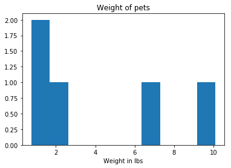

:orphan:

tables.ttools
=============

Ttools is an IRAF library used to build and manipulate STSDAS tables.

Notes
-----

**For questions or comments please see** `our github
page <https://github.com/spacetelescope/stak>`__. **We encourage and
appreciate user feedback.**

**Most of these notebooks rely on basic knowledge of the Astropy FITS
I/O module. If you are unfamiliar with this module please see the**
`Astropy FITS I/O user
documentation <http://docs.astropy.org/en/stable/io/fits/>`__ **before
using this documentation**.

Many of the table tools in this package are easily accesible with the
`Astropy Table <http://docs.astropy.org/en/stable/table/>`__ object.
Here we will show the ``Astropy`` ``Table`` equiavlent of the ttools
tasks. Below we import the example table we will be using. Please run
this cell before running any of the sections below.

Contents:

-  `imtab-tabim <#imtab-tabim>`__
-  `partab <#partab>`__
-  `tabpar <#tabpar>`__
-  `taextract-tainsert <#taextract-tainsert>`__
-  `tcalc <#tcalc>`__
-  `tchcol <#tchcol>`__
-  `tcopy-tdump <#tcopy-tdump>`__
-  `tdiffer <#tdiffer>`__
-  `texpand <#texpand>`__
-  `thhistogram <#thistogram>`__
-  `tiimage-titable-tximage-txtable <#tiimage-titable-tximage-txtable>`__
-  `tinfo-tlcol-tprint <#tinfo-tlcol-tprint>`__
-  `tintegrate <#tintegrate>`__
-  `tjoin <#tjoin>`__
-  `tmatch <#tmatch>`__
-  `tmerge <#tmerge>`__
-  `trebin <#trebin>`__
-  `tselect-tproject-tquery <#tselect-tproject-tquery>`__
-  `tsort <#tsort>`__
-  `tstat <#tstat>`__

.. code:: ipython3

    #Here we import the example table we will be using from a text file:
    from astropy.table import Table
    
    filename = "/eng/ssb/iraf_transition/test_data/table2.txt"
    ex_table = Table.read(filename, format='ascii')
    ex_table

.. raw:: html

    &lt;Table length=5&gt;
    <table id="table4540188768" class="table-striped table-bordered table-condensed">
    <thead><tr><th>Name</th><th>Animal</th><th>age</th><th>weight(lbs)</th></tr></thead>
    <thead><tr><th>str7</th><th>str9</th><th>int64</th><th>float64</th></tr></thead>
    <tr><td>Fluffy</td><td>cat</td><td>5</td><td>6.5</td></tr>
    <tr><td>Skippy</td><td>dog</td><td>7</td><td>10.1</td></tr>
    <tr><td>Potato</td><td>guineapig</td><td>2</td><td>2.5</td></tr>
    <tr><td>Squeaky</td><td>mouse</td><td>1</td><td>0.75</td></tr>
    <tr><td>Jhope</td><td>snake</td><td>5</td><td>25.0</td></tr>
    </table>

imtab-tabim
-----------

**Please review the** `Notes <#notes>`__ **section above before running
any examples in this notebook**

imtab can be used to copy an image to a table column. We can accomplish
this by first flattening the array, then putting it into a table. For
more details see the `Table construction
documentation <http://docs.astropy.org/en/stable/table/construct_table.html>`__.
Tabim is used to copy a column back to a table, show below.

.. code:: ipython3

    # Standard Imports
    import numpy as np
    
    # Astronomy Specific Imports
    from astropy.table import Table

.. code:: ipython3

    # Create test array and flatten
    image_array=np.random.rand(6,6)
    image_array=image_array.flatten()
    
    # Put into table, to make it a column we need the outside []
    t = Table([image_array])
    print(t)
    
    # Now to re-extract the array we have to grab the data and unflatten it.
    extract_array = t['col0'].data.reshape((6,6))
    print(extract_array)

.. parsed-literal::

          col0      
    ----------------
      0.778737912301
      0.540657453378
      0.844846864945
      0.437430786445
       0.42531847321
      0.378941776732
      0.569759441559
      0.887288689867
      0.140683275852
       0.75117263098
                 ...
         0.861420953
      0.574230666443
       0.42707825074
      0.987672488509
      0.610368735644
    0.00483079453182
      0.837378466165
       0.44437740426
      0.381211045687
     0.0859310763191
     0.0704851730697
    Length = 36 rows
    [[ 0.77873791  0.54065745  0.84484686  0.43743079  0.42531847  0.37894178]
     [ 0.56975944  0.88728869  0.14068328  0.75117263  0.39693562  0.96491753]
     [ 0.00303176  0.2884746   0.44517577  0.89533482  0.84799734  0.72115084]
     [ 0.16727558  0.59748484  0.35737339  0.788007    0.8695291   0.73762861]
     [ 0.34344701  0.86142095  0.57423067  0.42707825  0.98767249  0.61036874]
     [ 0.00483079  0.83737847  0.4443774   0.38121105  0.08593108  0.07048517]]

partab
------

**Please review the** `Notes <#notes>`__ **section above before running
any examples in this notebook**

Partab is used to transfer and IRAF parameter to a table element. Below
we show the ``Astropy Table`` equivalent using indexing. See the
`Modifying
Table <http://docs.astropy.org/en/stable/table/modify_table.html>`__
documentation for more details.

.. code:: ipython3

    # Astronomy Specific Imports
    from astropy.table import Table

.. code:: ipython3

    ex_table['weight(lbs)'][4]=1.5
    ex_table

.. raw:: html

    &lt;Table length=5&gt;
    <table id="table4567453456" class="table-striped table-bordered table-condensed">
    <thead><tr><th>Name</th><th>Animal</th><th>age</th><th>weight(lbs)</th></tr></thead>
    <thead><tr><th>str7</th><th>str9</th><th>int64</th><th>float64</th></tr></thead>
    <tr><td>Fluffy</td><td>cat</td><td>5</td><td>6.5</td></tr>
    <tr><td>Skippy</td><td>dog</td><td>7</td><td>10.1</td></tr>
    <tr><td>Potato</td><td>guineapig</td><td>2</td><td>2.5</td></tr>
    <tr><td>Squeaky</td><td>mouse</td><td>1</td><td>0.75</td></tr>
    <tr><td>Jhope</td><td>snake</td><td>5</td><td>1.5</td></tr>
    </table>

tabpar
------

**Please review the** `Notes <#notes>`__ **section above before running
any examples in this notebook**

The tabpar task takes a header keyword and moves it to an IRAF
parameter. Extracting values from an astropy table is straightfoward
with indexing. Keep in mind the indexing is zero based. When an FITS
file is read into a table, the header information is saved in the meta
data as an ``Ordered Dictionary``. Below we show you how to pull values
from the table data, and meta data.

.. code:: ipython3

    # Astronomy Specific Imports
    from astropy.table import Table

.. code:: ipython3

    # Pulling values out of a table
    column=ex_table['Name']
    print(column)
    entry=ex_table['Animal'][2]
    print('\n')
    print(entry)

.. parsed-literal::

      Name 
    -------
     Fluffy
     Skippy
     Potato
    Squeaky
      Jhope
    
    
    guineapig

.. code:: ipython3

    # Pulling values out of the meta data
    fits_file = '/eng/ssb/iraf_transition/test_data/08b18470j_imp.fits'
    fits_table = Table.read(fits_file, hdu=2)
    print(fits_table.meta)
    print(fits_table.meta['EXTNAME'])

.. parsed-literal::

    OrderedDict([('EXTNAME', 'PHOTPLAM'), ('EXTVER', 1)])
    PHOTPLAM

taextract-tainsert
------------------

**Please review the** `Notes <#notes>`__ **section above before running
any examples in this notebook**

Taextract and tainsert are used to copy scalar columns to array entries,
and vice versa. We will show how to store an array in an
``Astropy Table`` from a ``list`` of scalars.

.. code:: ipython3

    # Standard Imports
    import numpy as np
    
    # Astronomy Specific Imports
    from astropy.table import Table

.. code:: ipython3

    scalar_list = [4,5,6,7,8,9]
    
    # Change to array
    in_arr = np.array(scalar_list)
    
    # Store in table
    t = Table([[in_arr]])
    t.pprint()
    
    # Now extract array back to scalar list, flatten will take out the extra dimension
    out_arr = t['col0'][0]
    out_list = out_arr.tolist()
    print(out_list)

.. parsed-literal::

    col0 [6]
    --------
      4 .. 9
    [4, 5, 6, 7, 8, 9]

tcalc
-----

**Please review the** `Notes <#notes>`__ **section above before running
any examples in this notebook**

Tcalc is used to perform arithmetic operations on table columns. This
can be done automaticaly with any compatible data types. A new
``Column`` object will be returned.

.. code:: ipython3

    # Astronomy Specific Imports
    from astropy.table import Table

.. code:: ipython3

    out = ex_table['age'] + ex_table['weight(lbs)']
    out

.. raw:: html

    &lt;Column name=&apos;age&apos; dtype=&apos;float64&apos; length=5&gt;
    <table>
    <tr><td>11.5</td></tr>
    <tr><td>17.1</td></tr>
    <tr><td>4.5</td></tr>
    <tr><td>1.75</td></tr>
    <tr><td>6.5</td></tr>
    </table>

tchcol
------

**Please review the** `Notes <#notes>`__ **section above before running
any examples in this notebook**

tchcol is used to change the column name, format or units. This can be
done easily with ``Astropy Tables``, and the `Astropy
Units <http://docs.astropy.org/en/stable/units/>`__ module.

.. code:: ipython3

    # Astronomy Specific Imports
    from astropy.table import Table
    import astropy.units as u

.. code:: ipython3

    # Set filename, read in file
    filename = "/eng/ssb/iraf_transition/test_data/table2.txt"
    ed_table = Table.read(filename, format='ascii')
    
    # To get table info
    print(ed_table.info)
    
    # To add/update units
    ed_table['weight(lbs)'].unit = u.imperial.lb
    print(ed_table.info)
    
    # To change column name
    ed_table['weight(lbs)'].name='weight'
    print(ed_table.info)
    
    # To change dtype
    ed_table['age'].dtype = 'float64'
    print(ed_table.info)

.. parsed-literal::

    <Table length=5>
        name     dtype 
    ----------- -------
           Name    str7
         Animal    str9
            age   int64
    weight(lbs) float64
    
    <Table length=5>
        name     dtype  unit
    ----------- ------- ----
           Name    str7     
         Animal    str9     
            age   int64     
    weight(lbs) float64   lb
    
    <Table length=5>
     name   dtype  unit
    ------ ------- ----
      Name    str7     
    Animal    str9     
       age   int64     
    weight float64   lb
    
    <Table length=5>
     name   dtype  unit
    ------ ------- ----
      Name    str7     
    Animal    str9     
       age float64     
    weight float64   lb
    

tcopy-tdump
-----------

**Please review the** `Notes <#notes>`__ **section above before running
any examples in this notebook**

Tcopy is used to copy tables, and can save a table to ASCII or FITS
format. Similarly, tdump is used to save a table to an ASCII file. We
will show both save methods and a copy below. For more details see the
`unified
read/write <http://docs.astropy.org/en/stable/io/unified.html>`__
documentation. For more details on ``Table`` object copying see the
`copy versus
reference <http://docs.astropy.org/en/stable/table/construct_table.html#copy-versus-reference>`__
doc section.

.. code:: ipython3

    # Astronomy Specific Imports
    from astropy.table import Table

.. code:: ipython3

    # Make a copy of our example table
    tab_copy = ex_table.copy()
    
    # Save as ASCII
    outfile = 'copy_table.txt'
    tab_copy.write(outfile, format='ascii', overwrite=True)
    
    # Same method call to write to FITS
    outfits = 'copy_table.fits'
    tab_copy.write(outfits, overwrite=True)

tdiffer
-------

Will be available soon in Astropy

.. figure:: static/150pxblueconstuc.png
   :alt: Work in progress

texpand
-------

**Please review the** `Notes <#notes>`__ **section above before running
any examples in this notebook**

Texpand is used to edit and change tables according to a set of user
provided rules. This can be done by building a customized loop over the
input table. Below we show a simple example, but this can be easily
modified to fit the users needs.

.. code:: ipython3

    # Astronomy Specific Imports
    from astropy.table import Table

.. code:: ipython3

    # change a animal type of 'cat' or 'snake' to guineapig
    new_table = ex_table.copy()
    for row in new_table:
        if row[1] in ['cat','snake']:
            row[1]='guineapig'
    print(new_table)

.. parsed-literal::

      Name    Animal  age weight(lbs)
    ------- --------- --- -----------
     Fluffy guineapig   5         6.5
     Skippy       dog   7        10.1
     Potato guineapig   2         2.5
    Squeaky     mouse   1        0.75
      Jhope guineapig   5         1.5

thistogram
----------

**Please review the** `Notes <#notes>`__ **section above before running
any examples in this notebook**

Thistogram makes a histogram from a data column in a table. We can
easily accomplish this using the ``Astropy Tables`` and
`Matplotlib.pyplot.hist <https://matplotlib.org/devdocs/api/_as_gen/matplotlib.pyplot.hist.html>`__
tasks. For this example we will use the default binning. There is also
an `Astropy
histogram <http://docs.astropy.org/en/stable/api/astropy.stats.histogram.html>`__
and a `Numpy
histogram <https://docs.scipy.org/doc/numpy/reference/generated/numpy.histogram.html>`__
available for generating the histogram data.

.. code:: ipython3

    # Astronomy Specific Imports
    from astropy.table import Table
    
    # Plotting Imports/Setup
    import matplotlib.pyplot as plt
    %matplotlib inline

.. code:: ipython3

    # Using the weight column of our example table
    n, bins, patches = plt.hist(ex_table['weight(lbs)'].data)
    
    plt.xlabel('Weight in lbs')
    plt.title('Weight of pets')
    plt.show()

tiimage-titable-tximage-txtable
-------------------------------

**Please review the** `Notes <#notes>`__ **section above before running
any examples in this notebook**

Tiimage, titable, tximage, and txtable are all 3-D table functions.
``Astropy`` ``Table`` objects can store any dimension ``numpy`` arrays
in each element, as long as there is consistancy in the column. Below we
show a short example of storing a 3-D array in an ``Astropy`` Table. The
rest of the functionality is the same as the general table
funcitonality.

.. code:: ipython3

    # Standard Imports
    import numpy as np
    
    # Astronomy Specific Imports
    from astropy.table import Table

.. code:: ipython3

    # Storing a 2-D arrays in one column of a table
    arr1 = np.random.rand(60,90)
    arr2 = np.random.rand(60,90)
    # To retain the 2-D array as an element in the table, make sure you use two sets of square brackets
    three_table = Table([[arr1,arr2]],names=('Arrays',))
    three_table.pprint()
    
    # To pull out one array element, index column name then row numbers
    three_table['Arrays'][1]

.. parsed-literal::

             Arrays [60,90]         
    --------------------------------
    0.892760413585 .. 0.283382986211
    0.637760881193 .. 0.363642899902

.. parsed-literal::

    array([[ 0.63776088,  0.91520904,  0.02255264, ...,  0.68817791,
             0.53479407,  0.30667641],
           [ 0.97267867,  0.55856732,  0.86993039, ...,  0.91039544,
             0.63862112,  0.58102198],
           [ 0.51181066,  0.85164649,  0.05432316, ...,  0.36084783,
             0.58934112,  0.96374561],
           ..., 
           [ 0.83594372,  0.79412333,  0.78455287, ...,  0.88604032,
             0.16606121,  0.1500973 ],
           [ 0.81858617,  0.16964881,  0.00841479, ...,  0.66355838,
             0.95266558,  0.79603504],
           [ 0.81294063,  0.79609841,  0.58490711, ...,  0.3697692 ,
             0.65451337,  0.3636429 ]])

tinfo-tlcol-tprint
------------------

**Please review the** `Notes <#notes>`__ **section above before running
any examples in this notebook**

Tinfo, tlcol and tprint were all used to display information about the
table. Below we show the ``Astropy Table`` equivalents.

.. code:: ipython3

    # Astronomy Specific Imports
    from astropy.table import Table

.. code:: ipython3

    # For tinfo and tlcol
    print(ex_table.info)

.. parsed-literal::

    <Table length=5>
        name     dtype 
    ----------- -------
           Name    str7
         Animal    str9
            age   int64
    weight(lbs) float64
    

.. code:: ipython3

    # For tprint
    ex_table.pprint()

.. parsed-literal::

      Name    Animal  age weight(lbs)
    ------- --------- --- -----------
     Fluffy       cat   5         6.5
     Skippy       dog   7        10.1
     Potato guineapig   2         2.5
    Squeaky     mouse   1        0.75
      Jhope     snake   5         1.5

tintegrate
----------

**Please review the** `Notes <#notes>`__ **section above before running
any examples in this notebook**

Tintegrate is used to numerically integrate one column with respect to
another. This can be done using the `numpy.traz
function <https://docs.scipy.org/doc/numpy/reference/generated/numpy.trapz.html>`__.
As we have shown how to extract an array from a Table in various other
tasks in this notebook we will only cover the integration step here.

.. code:: ipython3

    # Standard Imports
    import numpy as np
    
    # Astronomy Specific Imports
    from astropy.table import Table

.. code:: ipython3

    # Setup array, here you would pull from a table
    x = [1, 2, 3, 4, 6]
    y = [10.5, 12.3, 22.2, 13.3, 7.7]
    
    result = np.trapz(y,x)
    print(result)

.. parsed-literal::

    67.4

tjoin
-----

**Please review the** `Notes <#notes>`__ **section above before running
any examples in this notebook**

Tjoin is used to perform a relational join of two tables. You can do all
join types (inner, left, right, and outer) in the Astropy ``Tables``
package, see `join docs
here <http://docs.astropy.org/en/stable/table/operations.html#join>`__
for more details. We take the examples shown here from the Astropy docs.

.. code:: ipython3

    # Astronomy Specific Imports
    from astropy.table import Table, join

.. code:: ipython3

    # Setup tables
    optical = Table.read("""name    obs_date    mag_b  mag_v
                            M31     2012-01-02  17.0   16.0
                            M82     2012-10-29  16.2   15.2
                            M101    2012-10-31  15.1   15.5""", format='ascii')
    xray = Table.read("""   name    obs_date    logLx
                            NGC3516 2011-11-11  42.1
                            M31     1999-01-05  43.1
                            M82     2012-10-29  45.0""", format='ascii')

.. code:: ipython3

    # Default inner join, default key column to set of columns that are common to both tables.
    opt_xray = join(optical, xray)
    print(opt_xray)

.. parsed-literal::

    name  obs_date  mag_b mag_v logLx
    ---- ---------- ----- ----- -----
     M82 2012-10-29  16.2  15.2  45.0

.. code:: ipython3

    # Left join
    print(join(optical, xray, join_type='left'))

.. parsed-literal::

    name  obs_date  mag_b mag_v logLx
    ---- ---------- ----- ----- -----
    M101 2012-10-31  15.1  15.5    --
     M31 2012-01-02  17.0  16.0    --
     M82 2012-10-29  16.2  15.2  45.0

.. code:: ipython3

    # Right join, with only name field as key
    print(join(optical, xray, join_type='right', keys='name'))

.. parsed-literal::

      name  obs_date_1 mag_b mag_v obs_date_2 logLx
    ------- ---------- ----- ----- ---------- -----
        M31 2012-01-02  17.0  16.0 1999-01-05  43.1
        M82 2012-10-29  16.2  15.2 2012-10-29  45.0
    NGC3516         --    --    -- 2011-11-11  42.1

.. code:: ipython3

    # Outer join
    print(join(optical, xray, join_type='outer'))

.. parsed-literal::

      name   obs_date  mag_b mag_v logLx
    ------- ---------- ----- ----- -----
       M101 2012-10-31  15.1  15.5    --
        M31 1999-01-05    --    --  43.1
        M31 2012-01-02  17.0  16.0    --
        M82 2012-10-29  16.2  15.2  45.0
    NGC3516 2011-11-11    --    --  42.1

tmatch
------

**Please review the** `Notes <#notes>`__ **section above before running
any examples in this notebook**

Tmatch is used to find the closest match between rows in two tables.
This functionality is contained in the `coordinates
package <http://docs.astropy.org/en/stable/coordinates/matchsep.html>`__
of Astropy. This example is taken from the `Coordinates
notebook <http://www.astropy.org/astropy-tutorials/Coordinates.html>`__,
see the notebook for more details.

.. code:: ipython3

    # Astronomy Specific Imports
    from astropy.table import Table
    from astropy.coordinates import SkyCoord
    from astropy import units as u

.. code:: ipython3

    # Open table files
    file1 = '/eng/ssb/iraf_transition/test_data/HCG7_SDSS_photo.dat'
    file2 = '/eng/ssb/iraf_transition/test_data/HCG7_2MASS.tbl'
    sdss = Table.read(file1, format='ascii')
    twomass = Table.read(file2, format='ascii')
    
    # Match between catalogs
    coo_sdss = SkyCoord(sdss['ra']*u.deg, sdss['dec']*u.deg)
    coo_twomass = SkyCoord(twomass['ra'], twomass['dec'])
    idx_sdss, d2d_sdss, d3d_sdss = coo_twomass.match_to_catalog_sky(coo_sdss)

tmerge
------

**Please review the** `Notes <#notes>`__ **section above before running
any examples in this notebook**

Tmerge is used to combine columns or rows of multiple tables. There are
two `Astropy Table
tasks <http://docs.astropy.org/en/stable/table/operations.html>`__ for
this, ``vstack`` and ``hstack``. We take these examples from the Astropy
table docs.

.. code:: ipython3

    # Astronomy Specific Imports
    from astropy.table import Table, vstack, hstack

.. code:: ipython3

    # Setup tables
    obs1 = Table.read("""name    obs_date    mag_b  logLx
                         M31     2012-01-02  17.0   42.5
                         M82     2012-10-29  16.2   43.5
                         M101    2012-10-31  15.1   44.5""", format='ascii')
    
    obs2 = Table.read("""name    obs_date    logLx
                         NGC3516 2011-11-11  42.1
                         M31     1999-01-05  43.1
                         M82     2012-10-30  45.0""", format='ascii')
    
    # Vertical stack
    print(vstack([obs1, obs2]))

.. parsed-literal::

      name   obs_date  mag_b logLx
    ------- ---------- ----- -----
        M31 2012-01-02  17.0  42.5
        M82 2012-10-29  16.2  43.5
       M101 2012-10-31  15.1  44.5
    NGC3516 2011-11-11    --  42.1
        M31 1999-01-05    --  43.1
        M82 2012-10-30    --  45.0

.. code:: ipython3

    # Setup tables
    t1 = Table.read("""a   b    c
                       1   foo  1.4
                       2   bar  2.1
                       3   baz  2.8""", format='ascii')
    t2 = Table.read("""d     e
                       ham   eggs
                       spam  toast""", format='ascii')
    
    # Horizontal stack
    print(hstack([t1, t2]))

.. parsed-literal::

     a   b   c   d     e  
    --- --- --- ---- -----
      1 foo 1.4  ham  eggs
      2 bar 2.1 spam toast
      3 baz 2.8   --    --

trebin
------

Trebin allows the user to rebin columns in a table using linear or
spline interpolation. See the `binning doc
section <http://docs.astropy.org/en/stable/table/operations.html#binning>`__
for a subset of this functionality.

.. figure:: static/150pxblueconstuc.png
   :alt: Work in progress

tselect-tproject-tquery
-----------------------

**Please review the** `Notes <#notes>`__ **section above before running
any examples in this notebook**

Tselect is used to create a new table from selected rows, tproject from
selected columns, and tquery from a combination of selected rows and
columns. We show two examples of how to generate a new table from
selected columns and selected rows. You can combine these two pieces of
code in either order to get a tquery like result. There is an alternate
way to do selections if you have already organized your table into
groups by using the `filter
method <http://docs.astropy.org/en/stable/table/operations.html#filtering>`__,
but the user will still need to write a custom filtering function to
provide to ``filter``.

.. code:: ipython3

    # Astronomy Specific Imports
    from astropy.table import Table

.. code:: ipython3

    # For adding rows we give the new table an initial column setup, 
    # copied from the original table through the dtype keyword
    table1 = Table(dtype=ex_table.dtype)
    for row in ex_table:
        if row['Name'] == 'Fluffy' or row['age'] == 5:
            table1.add_row(row)
    table1.pprint()

.. parsed-literal::

     Name  Animal age weight(lbs)
    ------ ------ --- -----------
    Fluffy    cat   5         6.5
     Jhope  snake   5         1.5

.. code:: ipython3

    # For adding columns we start with an empty new table
    table2 = Table()
    for col in ex_table.itercols():
        if col.name in ['Name','Animal']:
            table2[col.name] = col
    table2.pprint()

.. parsed-literal::

      Name    Animal 
    ------- ---------
     Fluffy       cat
     Skippy       dog
     Potato guineapig
    Squeaky     mouse
      Jhope     snake

tsort
-----

**Please review the** `Notes <#notes>`__ **section above before running
any examples in this notebook**

Tsort, as you would guess, sorts a table. ``Astropy`` ``Table`` objects
have a built in `sort
method <http://docs.astropy.org/en/stable/table/modify_table.html>`__.
You can even sort by more then one column. Sorting is inplace so in this
example we make a copy of the table first.

.. code:: ipython3

    # Standard Imports
    import numpy as np
    
    # Astronomy Specific imports
    from astropy.table import Table

.. code:: ipython3

    # sorting
    sorted_table = ex_table.copy()
    sorted_table.sort('Name')
    sorted_table.pprint()

.. parsed-literal::

      Name    Animal  age weight(lbs)
    ------- --------- --- -----------
     Fluffy       cat   5         6.5
      Jhope     snake   5         1.5
     Potato guineapig   2         2.5
     Skippy       dog   7        10.1
    Squeaky     mouse   1        0.75

tstat
-----

**Please review the** `Notes <#notes>`__ **section above before running
any examples in this notebook**

tstat gives you the mean, standard deviation, minimum and maximum of a
column. This can be done by feeding the desired columns into standard
``Numpy`` and built-in Python functions.

.. code:: ipython3

    # Standard Imports
    import numpy as np
    
    # Astronomy Specific Imports
    from astropy.table import Table

.. code:: ipython3

    # Mean
    mean = np.mean(ex_table['weight(lbs)'])
    print(mean)
    
    # Standard Deviation
    std = np.std(ex_table['weight(lbs)'])
    print(std)
                 
    # Min and Max
    mini = min(ex_table['age'])
    maxi = max(ex_table['age'])
    print(mini)
    print(maxi)

.. parsed-literal::

    4.27
    3.52584741587
    1
    7

Not Replacing
-------------

-  gtedit - Graphically edit a table. Deprecated.
-  gtpar - Pset to specify graph parameters for gtedit task. Deprecated.
-  keytab - Copy n image or table header keyword to a table element. See
   `Astropy
   Tables <http://docs.astropy.org/en/stable/table/index.html>`__
   documentation.
-  keypar - Copy an image or table header keyword to an IRAF parameter.
   See `Astropy FITS <http://docs.astropy.org/en/stable/io/fits/>`__
   documentation.
-  keyselect - Copy selected image header keywords to sdas table. See
   **images.imutil**
-  parkey - Put an IRAF parameter into an image or table header keyword.
   See `Astropy FITS <http://docs.astropy.org/en/stable/io/fits/>`__
   documentation.
-  tabkey - Copy a table element to an image or table header keyword.
   See the above notebook and `Astropy
   FITS <http://docs.astropy.org/en/stable/io/fits/>`__ documentation.
-  tcheck - Check STSDAS table element values. See `Astropy
   Tables <http://docs.astropy.org/en/stable/table/index.html>`__
   documentation.
-  tchsize - Change allocated sizes of various sections of a table.
   Deprecated.
-  tcreate - Create a FITS table from an ASCII descriptor table. see
   `tcopy-tdump <#tcopy-tdump>`__ and `Unified
   I/O <http://docs.astropy.org/en/stable/io/unified.html#fits>`__
   documentation.
-  tdelete - Delete tables. Deprecated.
-  tedit - Edit a table. See `Astropy
   Tables <http://docs.astropy.org/en/stable/table/index.html>`__
   documentation or `partab <#partab>`__.
-  thedit - Edit or print table header keywords. See
   **images.imutil.hedit**
-  thselect - Print table keyword values. See **images.imutil.hselect**
-  tlinear - Use linear regression to fit one or two table columns. See
   **images.imfit.fit1d**
-  tproduct - Form the Cartesian product of two tables. See
   `tjoin <#tjoin>`__
-  tread - Browse through a table. See `Astropy
   Tables <http://docs.astropy.org/en/stable/table/index.html>`__
   documentation.
-  tscopy - Copy row/column subsets of tables using selectors. See
   `tselect-tproject-tquery <#tselect-tproject-tquery>`__.
-  ttranspose - Transpose or flip a table. Deprecated.
-  tupar - Edit table header keywords. Interactive GUI. Deprecated
-  tupar - Edit table header keywords. Interactive GUI. See
   `tchcol <#tchcol>`__
